# Java for JavaScript Developers: The Complete Master Guide

> A comprehensive, prerequisite-driven master curriculum designed for JavaScript developers.
> Covers core Java mechanics, memory architecture, LeetCode data structures & algorithmic patterns,
> and enterprise application design principles with hands-on challenges and commented solutions.

## Table of Contents

- [**Module 1: Foundations & The Mental Model**](#module-1-foundations-the-mental-model)
  - [1.1 How Java Executes: The JVM, Bytecode & The JIT Compiler](#11-how-java-executes-the-jvm-bytecode-the-jit-compiler)
  - [1.2 Anatomy of a Java Program](#12-anatomy-of-a-java-program)
  - [1.3 Strict Rules: File Naming & Semicolons](#13-strict-rules-file-naming-semicolons)
  - [1.4 Console Output & Comments](#14-console-output-comments)
  - [1.5 Console Input with `java.util.Scanner`](#15-console-input-with-javautilscanner)
- [**Module 2: Variables, Types & The Memory Model**](#module-2-variables-types-the-memory-model)
  - [2.1 Static Typing vs. Dynamic Typing](#21-static-typing-vs-dynamic-typing)
  - [2.2 The 8 Primitive Types](#22-the-8-primitive-types)
  - [2.3 Type Inference with `var` (Java 10+)](#23-type-inference-with-var-java-10)
  - [2.4 Type Casting: Widening vs. Narrowing](#24-type-casting-widening-vs-narrowing)
  - [2.5 Variable Initialization Rules: Local vs. Instance Variables](#25-variable-initialization-rules-local-vs-instance-variables)
  - [2.6 Operators Breakdown](#26-operators-breakdown)
  - [2.7 Stack vs. Heap Memory: The Core Mental Model](#27-stack-vs-heap-memory-the-core-mental-model)
  - [2.8 Garbage Collection & GC Roots (How Memory Is Freed)](#28-garbage-collection-gc-roots-how-memory-is-freed)
  - [2.9 Wrapper Classes & Autoboxing](#29-wrapper-classes-autoboxing)
  - [2.10 Pass-by-Value Mechanics (The Reference Pointer)](#210-pass-by-value-mechanics-the-reference-pointer)
- [**Module 3: Strings & Text Manipulation**](#module-3-strings-text-manipulation)
  - [3.1 `String` is an Immutable Object](#31-string-is-an-immutable-object)
  - [3.2 The String Constant Pool & Equality](#32-the-string-constant-pool-equality)
  - [3.3 Essential LeetCode String Methods](#33-essential-leetcode-string-methods)
  - [3.4 Common String Utility Methods](#34-common-string-utility-methods)
  - [3.5 High-Performance Text Assembly: `StringBuilder`](#35-high-performance-text-assembly-stringbuilder)
  - [3.6 Modern Text Blocks (Java 15+)](#36-modern-text-blocks-java-15)
- [**Module 4: Control Flow & Logic**](#module-4-control-flow-logic)
  - [4.1 Conditionals (`if`, `else if`, `else`)](#41-conditionals-if-else-if-else)
  - [4.2 Switch Statements & Modern Switch Expressions](#42-switch-statements-modern-switch-expressions)
  - [4.3 Loops](#43-loops)
  - [4.4 Loop Controls (`break`, `continue`, Labels)](#44-loop-controls-break-continue-labels)
- [**Module 5: Methods (Functions in Java)**](#module-5-methods-functions-in-java)
  - [5.1 Method Anatomy & Call Stack Mechanics](#51-method-anatomy-call-stack-mechanics)
  - [5.2 Method Overloading](#52-method-overloading)
  - [5.3 Varargs (Variable-Length Arguments)](#53-varargs-variable-length-arguments)
  - [5.5 Early Returns in `void` Methods](#55-early-returns-in-void-methods)
  - [5.4 Null Safety & `Optional<T>` (Java 8+)](#54-null-safety-optionalt-java-8)
- [**Module 6: Arrays & Core Data Structures**](#module-6-arrays-core-data-structures)
  - [6.1 Fixed-Size Arrays & Memory Allocation](#61-fixed-size-arrays-memory-allocation)
  - [6.2 2D Arrays & Matrices](#62-2d-arrays-matrices)
  - [6.3 Array Utilities (`java.util.Arrays`)](#63-array-utilities-javautilarrays)
  - [6.4 Dynamic Arrays: `ArrayList<T>` vs. Primitive Arrays](#64-dynamic-arrays-arraylistt-vs-primitive-arrays)
  - [6.5 Canonical LeetCode Data Structures: `ListNode` & `TreeNode`](#65-canonical-leetcode-data-structures-listnode-treenode)
- [**Module 7: Object-Oriented Programming Foundations**](#module-7-object-oriented-programming-foundations)
  - [7.1 Classes, Fields, Constructors & `this`](#71-classes-fields-constructors-this)
  - [7.2 Access Modifiers & Encapsulation](#72-access-modifiers-encapsulation)
  - [7.3 `static` Context vs. Instance Context](#73-static-context-vs-instance-context)
  - [7.4 Modern Data Carriers: Records (Java 16+)](#74-modern-data-carriers-records-java-16)
  - [7.5 The `equals()` and `hashCode()` Contract](#75-the-equals-and-hashcode-contract)
  - [7.6 'final' Reference Immutability vs. Object State Mutability](#76-final-reference-immutability-vs-object-state-mutability)
  - [7.7 The `toString()` Contract & Object Identity](#77-the-tostring-contract-object-identity)
  - [7.8 Java Enums: Type-Safe Classes with Behavior](#78-java-enums-type-safe-classes-with-behavior)
  - [7.9 Nested, Inner & Anonymous Classes](#79-nested-inner-anonymous-classes)
- [**Module 8: Advanced OOP, Polymorphism & Design**](#module-8-advanced-oop-polymorphism-design)
  - [8.1 Inheritance (`extends`, `super`, `@Override`)](#81-inheritance-extends-super-override)
  - [8.2 Polymorphism & Dynamic Method Dispatch](#82-polymorphism-dynamic-method-dispatch)
  - [8.3 Abstract Classes vs. Interfaces](#83-abstract-classes-vs-interfaces)
  - [8.4 Composition over Inheritance](#84-composition-over-inheritance)
  - [8.5 Annotations: Compiler & Runtime Metadata](#85-annotations-compiler-runtime-metadata)
  - [8.6 Sealed Classes & Interfaces (Java 17 LTS: Discriminated Unions)](#86-sealed-classes-interfaces-java-17-lts-discriminated-unions)
- [**Module 9: Generics (Type-Safe Reusability)**](#module-9-generics-type-safe-reusability)
  - [9.1 Why Generics?](#91-why-generics)
  - [9.2 Generic Classes & Generic Methods](#92-generic-classes-generic-methods)
  - [9.3 Bounded Generics & The PECS Rule](#93-bounded-generics-the-pecs-rule)
  - [9.4 Type Erasure](#94-type-erasure)
- [**Module 10: The Java Collections Framework (JCF)**](#module-10-the-java-collections-framework-jcf)
  - [10.1 The Collections Architecture](#101-the-collections-architecture)
  - [10.2 Big-O Complexity Comparison Table](#102-big-o-complexity-comparison-table)
  - [10.3 Stacks & Queues: Use `ArrayDeque` (Not `java.util.Stack`!)](#103-stacks-queues-use-arraydeque-not-javautilstack)
  - [10.4 Heaps (`PriorityQueue`) in Java](#104-heaps-priorityqueue-in-java)
  - [10.5 Collection Pitfalls & How to Iterate Maps](#105-collection-pitfalls-how-to-iterate-maps)
  - [10.6 Sorting with `Comparable` vs `Comparator`](#106-sorting-with-comparable-vs-comparator)
- [**Module 11: Exception Handling & Robust Code**](#module-11-exception-handling-robust-code)
  - [11.1 The Exception Hierarchy](#111-the-exception-hierarchy)
  - [11.2 `try`, `catch`, `finally` & Multi-Catch](#112-try-catch-finally-multi-catch)
  - [11.3 Try-with-Resources & `AutoCloseable`](#113-try-with-resources-autocloseable)
- [**Module 12: Functional Java: Lambdas & Streams**](#module-12-functional-java-lambdas-streams)
  - [12.1 Lambdas & Single Abstract Method (SAM) Interfaces](#121-lambdas-single-abstract-method-sam-interfaces)
  - [12.2 Standard Functional Interfaces (`java.util.function`)](#122-standard-functional-interfaces-javautilfunction)
  - [12.3 Method References (`::`)](#123-method-references-)
  - [12.4 The Stream API Pipeline](#124-the-stream-api-pipeline)
- [**Module 13: Packages, Date/Time & Modern File I/O**](#module-13-packages-datetime-modern-file-io)
  - [13.1 Packages & Imports](#131-packages-imports)
  - [13.2 Modern Date & Time (`java.time`)](#132-modern-date-time-javatime)
  - [13.3 Modern File I/O (`java.nio.file.Files`)](#133-modern-file-io-javaniofilefiles)
- [**Module 14: Java Ecosystem, Build Tools & Frameworks**](#module-14-java-ecosystem-build-tools-frameworks)
  - [14.1 Build Systems: Maven & Gradle](#141-build-systems-maven-gradle)
  - [14.2 What is a JAR File Physically?](#142-what-is-a-jar-file-physically)
  - [14.3 Database Persistence: JDBC, JPA & Hibernate](#143-database-persistence-jdbc-jpa-hibernate)
  - [14.4 Enterprise Frameworks: Spring Boot](#144-enterprise-frameworks-spring-boot)

---

## Module 1: Foundations & The Mental Model

Welcome to Java! If you are coming from JavaScript, you are stepping from a dynamically typed, interpreted/JIT-compiled, single-threaded event-driven environment into a strongly typed, class-centric, multi-threaded virtual machine ecosystem.

### 1.1 How Java Executes: The JVM, Bytecode & The JIT Compiler

In JavaScript (Node.js or browsers), the engine (like Google's V8) ingests raw `.js` text files directly, parses them into an Abstract Syntax Tree (AST), and interprets/JIT-compiles them on the fly.

Java does not run your `.java` source code directly. It uses a **two-phase execution pipeline**:

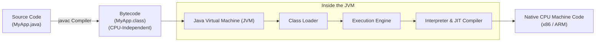

1. **Compilation Phase (`javac`):** The Java Compiler (`javac`) checks your code for syntax and strict type correctness. If successful, it emits binary **bytecode** files with a `.class` extension. Bytecode is not machine code for your Intel, AMD, or Apple Silicon CPU; it is machine code for an idealized software computer: the **Java Virtual Machine (JVM)**.
2. **Execution Phase (`java`):** When you run `java MyApp`, the JVM starts up:
   - **Class Loader:** Reads the `.class` files into memory.
   - **Bytecode Verifier:** Validates that the bytecode adheres to memory-safety constraints (no buffer overflows, illegal pointer operations).
   - **Interpreter:** Begins executing bytecode instruction-by-instruction immediately for fast startup.
   - **JIT (Just-In-Time) Compiler:** Monitors "hot spots" (frequently executed loops and methods). Once identified, it compiles those hot bytecode blocks directly into high-speed native CPU machine instructions, caching them so they run as fast as compiled C/C++.

> [!NOTE]
> **The "Write Once, Run Anywhere" (WORA) Promise:**
> Because bytecode targets the JVM rather than physical hardware, you can compile a `.java` file on a Mac, send the `.class` file to an Ubuntu server or Windows machine, and it runs identically as long as a JVM is installed.

### 1.2 Anatomy of a Java Program

In Java, **everything belongs inside a class**. Unlike JavaScript, you cannot write loose statements or top-level functions outside of a class structure.

```java
// File: HelloWorld.java
public class HelloWorld {

    // The universal application entry point
    public static void main(String[] args) {
        System.out.println("Hello, World!");
    }
}
```

Let's dissect every single keyword in `public static void main(String[] args)`:
- `public`: An access modifier meaning this method can be called by code outside its package—specifically by the external JVM runtime.
- `static`: Means the method belongs directly to the `HelloWorld` class blueprint itself, not to any individual instance object. The JVM can call `HelloWorld.main()` without needing to construct an instance (`new HelloWorld()`) first.
- `void`: The return type. The `main` method performs work but returns no data back to the JVM caller.
- `main`: The exact name that the JVM searches for to begin execution.
- `String[] args`: An array of Strings representing command-line arguments passed when launching the program (e.g. `java HelloWorld foo bar` passes `["foo", "bar"]`).

### 1.3 Strict Rules: File Naming & Semicolons

1. **Class-to-File Name Matching:** If your file contains a `public class Foo`, the physical file on your hard drive **must** be named `Foo.java` (exact matching case). A `.java` file can have only **one** `public` class.
2. **Mandatory Semicolons:** In JavaScript, Automatic Semicolon Insertion (ASI) forgives missing semicolons. In Java, semicolons (`;`) are **strictly mandatory**. If you omit even one semicolon, compilation fails immediately.

### 1.4 Console Output & Comments

Java interacts with the system console through the `java.lang.System` class:

```java
// Prints text and automatically moves to a new line (equivalent to console.log)
System.out.println("Hello with newline");

// Prints text but keeps the cursor on the same line
System.out.print("Part 1 - ");
System.out.print("Part 2\n");

// Formatted printing (similar to C's printf or template strings)
String name = "Alex";
int rank = 1;
System.out.printf("User %s achieved rank #%d%n", name, rank);
```

#### Format Specifiers Explained (`System.out.printf`)
- `%s`: Replaces with a `String`.
- `%d`: Replaces with an integer (`int`, `long`, `byte`, `short`).
- `%.2f`: Replaces with a floating-point number (`double`, `float`) rounded to 2 decimal places.
- `%-25s`: Left-aligns text within a 25-character wide field (ideal for table columns).
- `%5d`: Right-aligns an integer within a 5-character wide field.
- `%n`: A **platform-independent newline** (handles Windows `\r\n` vs Unix `\n` automatically).

#### Standard Java Project Structure
Java projects follow a universally standard directory layout:
```text
my-project/
├── pom.xml                     <-- Maven dependencies and build configuration
└── src/
    ├── main/
    │   ├── java/               <-- Production Java source code (.java files)
    │   └── resources/          <-- Application config, static assets, SQL files
    └── test/
        └── java/               <-- Automated tests (JUnit)
```
```java
```

**Types of Comments:**
```java
// 1. Single-line comment

/*
   2. Multi-line comment
*/

/**
 * 3. Javadoc comment: The compiler extracts these comments to generate
 * standard HTML API documentation (like official Oracle docs).
 * @param query The search keyword.
 * @return The number of results found.
 */
public int search(String query) {
    return 0;
}
```

### 1.5 Console Input with `java.util.Scanner`

While `System.out.println` prints to the terminal, reading user input from the console uses **`java.util.Scanner`** wrapping `System.in`:

```java
import java.util.Scanner;

public class ConsoleInputDemo {
    public static void main(String[] args) {
        // Create scanner connected to standard input stream
        Scanner scanner = new Scanner(System.in);

        System.out.print("Enter your name: ");
        String name = scanner.nextLine(); // Reads full line of text

        System.out.print("Enter your age: ");
        int age = scanner.nextInt();       // Reads an integer

        System.out.printf("Hello %s, next year you will be %d!%n", name, age + 1);

        scanner.close(); // Clean up resource
    }
}
```

> [!WARNING]
> **⚠️ The Scanner `nextInt()` Newline Trap:**
> When a user types `25` and presses Enter, the input stream receives `25\n`.
> - `scanner.nextInt()` consumes `25` but leaves the newline `\n` sitting in the buffer!
> - If you subsequently call `scanner.nextLine()`, it immediately consumes that leftover `\n` and returns an empty string without waiting for user input!
> - **The Fix:** Always consume the leftover newline by calling an extra `scanner.nextLine()` right after `nextInt()`, `nextDouble()`, or `next()`.


---

### Module 1 Practice Challenges

#### Challenge 1.1: Command-Line Argument Greeter
**Problem:** Write a program that reads the first command-line argument passed to it. If an argument is provided, print `"Hello, <name>! Welcome to Java."`. If no arguments are provided, print `"Hello, Guest! Welcome to Java."`.

**Thought Process & Strategy (Step-by-Step):**
1. **Identify the Input Source:** Command-line words typed after `java ProgramName` are passed into the `String[] args` array.
2. **Handle Empty Input Safely:** If the user runs `java Greeter` with zero inputs, accessing `args[0]` throws an `ArrayIndexOutOfBoundsException`! We must check `args.length > 0` first.
3. **Branch Decision:** If `args.length > 0`, extract `args[0]`; otherwise use fallback `"Guest"`.

```java
public class Greeter {
    public static void main(String[] args) {
        // args is never null, but its length may be 0 if no arguments are passed
        if (args.length > 0) {
            // Access the first command-line argument at index 0
            String userName = args[0];
            System.out.println("Hello, " + userName + "! Welcome to Java.");
        } else {
            // Default fallback when the user runs just: java Greeter
            System.out.println("Hello, Guest! Welcome to Java.");
        }
    }
}
// Time Complexity: O(1)
// Space Complexity: O(1)
```

#### Challenge 1.2: Formatted Invoice Summary
**Problem:** Write a program that prints a formatted invoice receipt for 3 items with fixed names, quantities, and unit prices, formatted neatly into columns using `System.out.printf`.

**Thought Process & Strategy (Step-by-Step):**
1. **Define Fixed Column Widths:** To ensure columns align regardless of item name length, allocate 25 characters for item name, 5 characters for quantity, and 10 characters for price.
2. **Choose Alignment:** Use left-alignment (`%-25s`) for text and right-alignment (`%5d`, `%10.2f`) for numbers and currency.
3. **Calculate and Print:** Compute subtotal $\sum (qty \times price)$ and print the totals divider.

```java
public class InvoicePrinter {
    public static void main(String[] args) {
        String item1 = "Mechanical Keyboard";
        int qty1 = 1;
        double price1 = 120.50;

        String item2 = "USB-C Cable";
        int qty2 = 2;
        double price2 = 15.25;

        // Print header with column widths: %-25s = left-aligned 25 chars, %5s = right-aligned 5 chars
        System.out.printf("%-25s %5s %10s%n", "Item", "Qty", "Price");
        System.out.println("---------------------------------------------");

        // Print each item row: %-25s for string, %5d for int, %10.2f for currency float
        System.out.printf("%-25s %5d %10.2f%n", item1, qty1, price1);
        System.out.printf("%-25s %5d %10.2f%n", item2, qty2, price2);

        double total = (qty1 * price1) + (qty2 * price2);
        System.out.println("---------------------------------------------");
        System.out.printf("%-31s %10.2f%n", "Total Due:", total);
    }
}
// Time Complexity: O(1)
// Space Complexity: O(1)
```


---

## Module 2: Variables, Types & The Memory Model

### 2.1 Static Typing vs. Dynamic Typing

In JavaScript, types belong to the *values*, not the variables:
```javascript
let data = 42;       // data holds a number
data = "now a string"; // completely valid in JS
```
In Java, types belong to the **variable container itself**. Once declared, a variable's type is immutable:
```java
int count = 42;
// count = "hello"; // COMPILE ERROR: incompatible types: String cannot be converted to int
```

### 2.2 The 8 Primitive Types

Java separates all data into two categories: **Primitives** and **Objects**.
Primitives represent raw, foundational numbers, characters, and booleans. They store their value directly in binary format without object overhead:

| Primitive | Size in Memory | Range / Value | Suffix / Notes |
|---|---|---|---|
| `byte` | 8 bits (1 byte) | -128 to 127 | For raw binary streams / networking |
| `short` | 16 bits (2 bytes) | -32,768 to 32,767 | Rarely used |
| `int` | 32 bits (4 bytes) | -2,147,483,648 to 2,147,483,647 (~2.14B) | Default for integer arithmetic |
| `long` | 64 bits (8 bytes) | -9 quintillion to +9 quintillion | Must append `L`: `10000000000L` |
| `float` | 32 bits (4 bytes) | ~7 decimal digits of precision | Must append `f`: `3.1415f` |
| `double` | 64 bits (8 bytes) | ~15-17 decimal digits of precision | Default for floating-point numbers |
| `boolean` | 1 bit (virtual) | `true` or `false` only | Strict: No truthy/falsy conversions |
| `char` | 16 bits (2 bytes) | Single UTF-16 character (`'a'`, `'Z'`, `'\u0041'`) | Must use **single quotes** |

> [!WARNING]
> **⚠️ Suffix Gotchas for Beginners:**
> 1. **Floating-point default:** Java treats decimal numbers as `double` by default. Writing `float price = 19.99;` causes a compile error. You must explicitly write `19.99f`.
> 2. **Integer literal default:** Java treats all whole numbers as `int`. A number larger than 2.14 billion requires an `L` suffix: `long population = 8000000000L;`.
> 3. **Integer division trap:** `int result = 5 / 2;` evaluates to `2`, NOT `2.5`. Java truncates the remainder in integer division. To get a decimal, cast or write a floating-point literal: `double result = 5.0 / 2;` (`2.5`).

### 2.3 Type Inference with `var` (Java 10+)

For local variables where the initializer makes the type obvious, Java allows the `var` keyword:

```java
var score = 100;                 // Compiler infers 'int'
var greeting = "Hello";          // Compiler infers 'String'
var list = new ArrayList<String>(); // Cleaner than repeating ArrayList<String>
```

> [!NOTE]
> `var` in Java is **NOT** dynamic typing like JavaScript's `let` or `var`. It is compile-time syntactic sugar. Once inferred, the type is permanently locked. `var` cannot be used for method parameters or class fields.


### 2.4 Type Casting: Widening vs. Narrowing

Converting data between compatible types is called **type casting**:

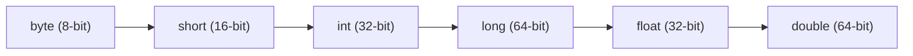

1. **Widening Casting (Automatic / Implicit):**
   Converting a smaller type to a larger type size. No precision is lost, so Java does this automatically:
   ```java
   int small = 42;
   double large = small; // Automatic widening: 42.0
   ```
2. **Narrowing Casting (Manual / Explicit):**
   Converting a larger type to a smaller type size. Decimal truncation or numeric overflow can occur, so the compiler requires an explicit cast with `(TargetType)`:
   ```java
   double pi = 3.14159;
   int truncated = (int) pi; // Explicit narrowing: 3 (decimals dropped!)
   ```

### 2.5 Variable Initialization Rules: Local vs. Instance Variables

> [!IMPORTANT]
> **Initialization Rules Depend on Scope:**
> - **Instance Fields (Inside a class):** The JVM automatically initializes them to defaults (`0` for numbers, `false` for booleans, `null` for objects).
> - **Local Variables (Inside a method):** The JVM **never** initializes local variables. Reading an uninitialized local variable causes a compile-time error: `variable might not have been initialized`.

### 2.6 Operators Breakdown

- **Arithmetic:** `+`, `-`, `*`, `/`, `%` (modulo).
- **Unary:** `++` (increment), `--` (decrement).
  - Prefix (`++i`): increments *before* expression evaluation.
  - Postfix (`i++`): evaluates first, then increments.
- **Relational:** `==`, `!=`, `<`, `>`, `<=`, `>=`.
- **Logical:** `&&` (short-circuit AND), `||` (short-circuit OR), `!` (NOT).
  - *Short-circuit:* In `false && someMethod()`, `someMethod()` is never executed.
- **Bitwise:** `&` (AND), `|` (OR), `^` (XOR), `~` (NOT), `<<` (left shift), `>>` (signed right shift), `>>>` (unsigned right shift).
- **Ternary:** `condition ? valueIfTrue : valueIfFalse`.

### 2.7 Stack vs. Heap Memory: The Core Mental Model

The relationship between variables and memory is the cornerstone of Java:

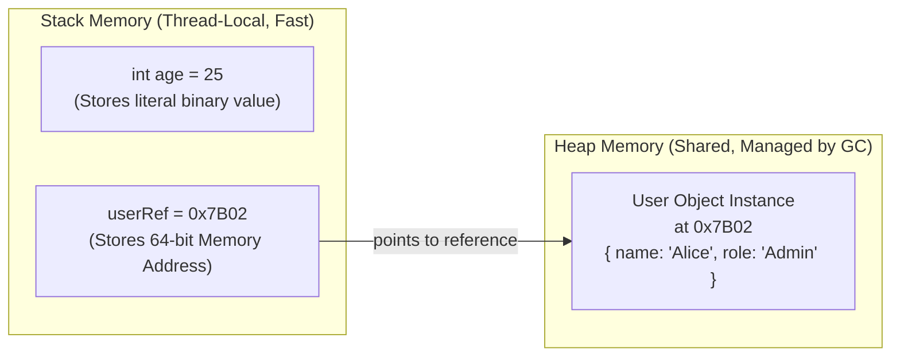

- **Stack Memory:**
  - Fast, thread-safe memory.
  - Holds local primitive variables and method call stack frames.
  - When a method finishes, its entire stack frame is instantly popped and cleared.
- **Heap Memory:**
  - Shared memory pool where **all Objects** reside.
  - Variables on the stack do not hold the object itself; they hold a **reference pointer** (memory address) pointing to the heap object.
  - Objects remain on the heap until the **Garbage Collector (GC)** determines that no active references point to them.

### 2.8 Garbage Collection & GC Roots (How Memory Is Freed)

In C/C++, developers must manually manage and free memory (`malloc` / `free`). In JavaScript and Python, memory is collected automatically. Java also manages memory automatically via the **Garbage Collector (GC)**.

Unlike naive runtimes that use simple reference counting (which fails on circular references), Java uses **Tracing Reachability from GC Roots**:

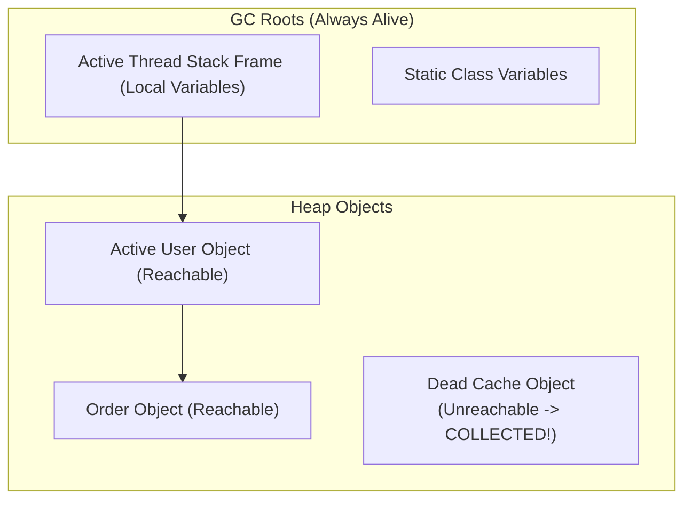

- **What is a GC Root?** An anchor point known to be alive:
  1. Local variables currently on any thread's execution stack frame.
  2. `static` fields of loaded classes.
  3. Active thread instances.
- **The Reachability Algorithm:** The GC traverses the object graph starting at all GC Roots. Any object that cannot be reached through a chain of references from a GC Root is marked as **garbage** and its memory is reclaimed during the next GC cycle.

> [!WARNING]
> **⚠️ Java Memory Leaks Still Happen:**
> If you append objects to a `public static List<User> cache` and never remove them, the static field acts as a permanent GC Root. Those objects will **never** be garbage collected, eventually crashing your application with an `OutOfMemoryError: Java heap space`!


### 2.9 Wrapper Classes & Autoboxing

Each primitive has an object wrapper in `java.lang`:
`int` $\leftrightarrow$ `Integer`, `double` $\leftrightarrow$ `Double`, `boolean` $\leftrightarrow$ `Boolean`, `char` $\leftrightarrow$ `Character`, `long` $\leftrightarrow$ `Long`, `byte` $\leftrightarrow$ `Byte`, `short` $\leftrightarrow$ `Short`, `float` $\leftrightarrow$ `Float`.

Java automatically boxes and unboxes between primitives and wrappers:
```java
Integer boxed = 42; // Autoboxing: compiler converts to Integer.valueOf(42)
int primitive = boxed; // Unboxing: compiler calls boxed.intValue()
```

> [!WARNING]
> **⚠️ The Integer Cache Bug (-128 to 127):**
> Java caches `Integer` object instances for values between `-128` and `127` to optimize memory.
> ```java
> Integer a = 100;
> Integer b = 100;
> System.out.println(a == b); // TRUE: Both point to the same cached object!
>
> Integer x = 200;
> Integer y = 200;
> System.out.println(x == y); // FALSE: Distinct heap objects!
> System.out.println(x.equals(y)); // TRUE: Checks actual value
> ```
> **Never compare objects (including wrapper classes) with `==`. Always use `.equals()`.**

### 2.10 Pass-by-Value Mechanics (The Reference Pointer)

> [!IMPORTANT]
> **Java is 100% Pass-By-Value.**
> When you pass an argument to a method, Java **always copies the value**.
> - For primitives, Java copies the raw literal number.
> - For objects, Java copies the **reference pointer address**, NOT the object itself.

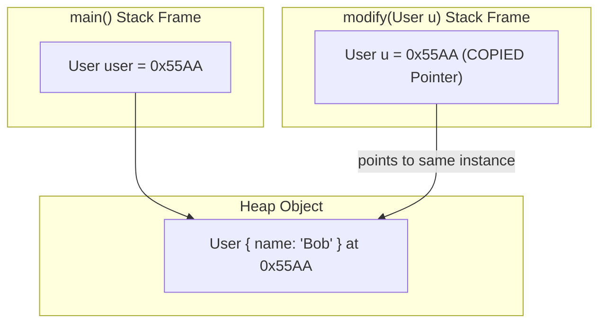

```java
public class PassByValueDemo {
    public static void modifyPrimitive(int x) {
        x = 999; // Only modifies local stack copy; caller's value is unchanged
    }

    public static void modifyObjectState(User u) {
        u.name = "Alice"; // Mutates the shared object at address 0x55AA on the Heap!
    }

    public static void reassignObject(User u) {
        u = new User("Charlie"); // Overwrites local pointer 'u'; caller still points to 0x55AA!
    }
}
```

---

### Module 2 Practice Challenges

#### Challenge 2.1: Temperature Precision Converter
**Problem:** Write a function `double fahrenheitToCelsius(double fahrenheit)` that accurately converts temperature without precision loss. Formula: $C = (F - 32) 	imes rac{5}{9}$.

```java
public class TemperatureConverter {
    public static double fahrenheitToCelsius(double fahrenheit) {
        // Notice we write 5.0 / 9.0 instead of 5 / 9 to prevent integer truncation to 0!
        return (fahrenheit - 32.0) * (5.0 / 9.0);
    }

    public static void main(String[] args) {
        double f = 98.6;
        double c = fahrenheitToCelsius(f);
        System.out.printf("%.1f F is %.2f C%n", f, c); // Output: 98.6 F is 37.00 C
    }
}
// Time Complexity: O(1)
// Space Complexity: O(1)
```

#### Challenge 2.2 (LeetCode Warmup): Bitwise In-Place Variable Swap
**Problem:** Given two integer variables `a` and `b`, swap their values without using any third temporary variable using bitwise XOR (`^`).

**Thought Process & Strategy (Step-by-Step):**
1. **Leverage XOR Properties:**
   - $x \oplus x = 0$ (A number XORed with itself cancels out to 0).
   - $x \oplus 0 = x$ (A number XORed with 0 stays unchanged).
   - Commutative: Order of operations does not matter.
2. **Step 1:** Set `a = a ^ b`. Now `a` holds the combined bitmask.
3. **Step 2:** Set `b = a ^ b`. Substituting `a` gives `(a ^ b) ^ b = a ^ 0 = a`. Now `b` holds original `a`.
4. **Step 3:** Set `a = a ^ b`. Substituting gives `(a ^ b) ^ a = b ^ 0 = b`. Now `a` holds original `b`.

```java
public class BitwiseSwap {
    public static void main(String[] args) {
        int a = 15; // Binary: 00001111
        int b = 27; // Binary: 00011011

        System.out.println("Before swap: a = " + a + ", b = " + b);

        // Step 1: a becomes the combined bitmask of both numbers
        a = a ^ b;
        // Step 2: XORing the mask with b cancels out b, leaving original a in b!
        b = a ^ b;
        // Step 3: XORing the mask with new b (original a) leaves original b in a!
        a = a ^ b;

        System.out.println("After swap:  a = " + a + ", b = " + b);
    }
}
// Time Complexity: O(1)
// Space Complexity: O(1)
```


---

## Module 3: Strings & Text Manipulation

### 3.1 `String` is an Immutable Object

In JavaScript, strings are primitive values with wrapper methods.
In Java, `String` is a reference class (`java.lang.String`). Strings are strictly **immutable**. Once a `String` instance is allocated on the heap, its character array cannot be modified.

```java
String str = "Hello";
str.concat(", World!"); // Returns a NEW String object; does not mutate 'str'
System.out.println(str); // Still prints "Hello"

str = str.concat(", World!"); // Reassigns 'str' variable to point to the new object
```

### 3.2 The String Constant Pool & Equality

Because strings are ubiquitous, Java allocates string literals in a dedicated heap zone called the **String Constant Pool (Internment Pool)**:

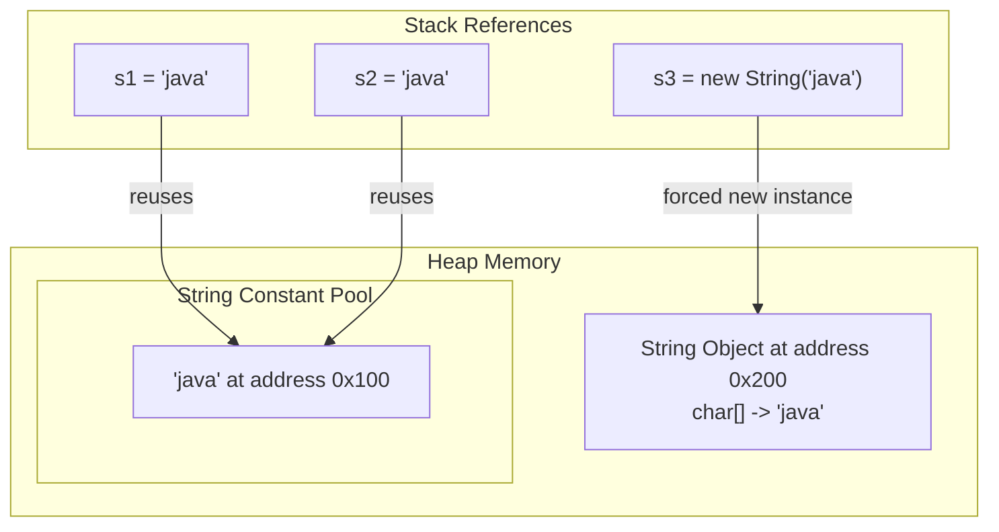

> [!WARNING]
> **⚠️ The String `==` Trap:**
> - `s1 == s2` is `true` because both literal declarations share the exact same interned memory address `0x100`.
> - `s1 == s3` is **`false`** because `new String()` forces a brand new object on the heap at `0x200`.
> - `s1.equals(s3)` is **`true`** because `.equals()` compares character contents.
> **Always use `.equals()` or `.equalsIgnoreCase()` for string comparisons.**

### 3.3 Essential LeetCode String Methods

Mastering these methods is critical for solving coding interview questions in Java:

```java
String s = "LeetCode Java";

// 1. Character at index (0-indexed)
char c = s.charAt(0); // 'L'

// 2. Length of the string (Method call with parentheses, unlike array .length!)
int len = s.length(); // 13

// 3. Convert to char array (crucial for in-place two-pointer problems!)
char[] chars = s.toCharArray();

// 4. Substring extraction: substring(startIndex, endIndexExclusive)
String sub = s.substring(0, 4); // "Leet"

// 5. Index search
int idx = s.indexOf("Code"); // 4 (-1 if not found)

// 6. Trimming & Case conversion
String trimmed = "  abc  ".trim(); // "abc"
String lower = s.toLowerCase();

// 7. Converting numbers/chars to String
String strVal = String.valueOf(123); // "123"
```


### 3.4 Common String Utility Methods

```java
String text = "Java,Python,JavaScript";

// 1. Splitting by delimiter (returns a String array)
String[] parts = text.split(","); // ["Java", "Python", "JavaScript"]

// 2. Joining elements with a delimiter (Java 8+)
String joined = String.join(" | ", parts); // "Java | Python | JavaScript"

// 3. Substring existence checks
boolean hasJava = text.contains("Java");      // true
boolean starts = text.startsWith("Java");     // true
boolean ends = text.endsWith("Script");       // true

// 4. Replacing characters or substrings (returns a new String)
String replaced = text.replace("Python", "Go"); // "Java,Go,JavaScript"
```

> [!NOTE]
> **Regex Warning with `.split()`:**
> `split()` takes a regular expression. To split on a period `.` or pipe `|` (special regex characters), escape them with double backslashes: `text.split("\\.")`.

### 3.5 High-Performance Text Assembly: `StringBuilder`

Because Strings are immutable, concatenating strings in a loop with `+` has an $O(n^2)$ time complexity due to creating a new copy at every step:

```java
// SLOW (Anti-pattern): Allocates 10,000 temporary String objects on Heap
String s = "";
for (int i = 0; i < 10000; i++) {
    s += i;
}

// FAST (Best Practice): O(n) time, single dynamically resizing mutable buffer
StringBuilder sb = new StringBuilder();
for (int i = 0; i < 10000; i++) {
    sb.append(i);
}
String result = sb.toString();
```

**Common `StringBuilder` Operations:**
- `sb.append("text")`: Appends to the end.
- `sb.insert(0, "prefix")`: Inserts at index.
- `sb.deleteCharAt(i)`: Deletes char at index.
- `sb.reverse()`: Reverses the sequence in-place (LeetCode favorite).
- `sb.setCharAt(i, 'c')`: Modifies char at index.

### 3.6 Modern Text Blocks (Java 15+)

Similar to JavaScript template literals (backticks `` ` ``), Java 15 provides **Text Blocks** using triple double quotes:

```java
String json = """
    {
        "name": "Alex",
        "role": "Engineer",
        "active": true
    }
    """;
```
The compiler detects the indentation of the closing delimiter and automatically strips incidental leading whitespace.

---

### Module 3 Practice Challenges

#### Challenge 3.1 (LeetCode 125): Valid Palindrome
**Problem:** A phrase is a palindrome if, after converting all uppercase letters into lowercase letters and removing all non-alphanumeric characters, it reads the same forward and backward. Implement `isPalindrome(String s)`.

**Thought Process & Strategy (Step-by-Step):**
1. **Optimize Space:** Avoid regex copying (`s.replaceAll(...)`) which allocates $O(n)$ extra memory. Use an in-place two-pointer approach ($O(1)$ space).
2. **Two Pointers:** Place `left = 0` at the start and `right = s.length() - 1` at the end.
3. **Skip Irrelevant Characters:** Advance `left` forward until it points to a letter or digit (via `Character.isLetterOrDigit()`). Decrement `right` backward similarly.
4. **Compare Characters:** Convert both to lowercase (`Character.toLowerCase()`). If they mismatch, return `false`. If they match, advance both pointers inward until they meet.

```java
public class ValidPalindrome {
    public static boolean isPalindrome(String s) {
        // Two-pointer approach: one starting from head, one from tail
        int left = 0;
        int right = s.length() - 1;

        while (left < right) {
            // Skip non-alphanumeric characters on the left
            while (left < right && !Character.isLetterOrDigit(s.charAt(left))) {
                left++;
            }
            // Skip non-alphanumeric characters on the right
            while (left < right && !Character.isLetterOrDigit(s.charAt(right))) {
                right--;
            }

            // Compare lowercased characters
            char leftChar = Character.toLowerCase(s.charAt(left));
            char rightChar = Character.toLowerCase(s.charAt(right));

            if (leftChar != rightChar) {
                return false; // Mismatch found
            }

            left++;
            right--;
        }

        return true; // All characters matched
    }

    public static void main(String[] args) {
        String test = "A man, a plan, a canal: Panama";
        System.out.println("Is palindrome: " + isPalindrome(test)); // true
    }
}
// Time Complexity: O(n) - Single pass over string of length n
// Space Complexity: O(1) - Constant auxiliary space
```

#### Challenge 3.2 (LeetCode 242): Valid Anagram
**Problem:** Given two strings `s` and `t`, return `true` if `t` is an anagram of `s` (contains the exact same characters in any order), and `false` otherwise. Assume strings contain only lowercase English letters.

**Thought Process & Strategy (Step-by-Step):**
1. **Initial Guard Check:** If `s.length() != t.length()`, they cannot be anagrams. Return `false` immediately.
2. **Choose the Frequency Array:** Since characters are restricted to lowercase English letters (`a` to `z`), an `int[26]` array is faster and uses less memory than a `HashMap`.
3. **Increment and Decrement:** In a single pass, increment counts for characters in `s` and decrement counts for characters in `t`.
4. **Verify Zero Counts:** If `t` is a valid anagram, every index in `counts` must be `0`.

```java
public class ValidAnagram {
    public static boolean isAnagram(String s, String t) {
        // Anagrams must have identical length
        if (s.length() != t.length()) {
            return false;
        }

        // Fixed-size frequency bucket for 26 lowercase English letters ('a' through 'z')
        int[] counts = new int[26];

        // Increment for characters in s, decrement for characters in t
        for (int i = 0; i < s.length(); i++) {
            counts[s.charAt(i) - 'a']++;
            counts[t.charAt(i) - 'a']--;
        }

        // If all character frequencies canceled out to 0, it is a valid anagram
        for (int count : counts) {
            if (count != 0) {
                return false;
            }
        }

        return true;
    }

    public static void main(String[] args) {
        System.out.println(isAnagram("anagram", "nagaram")); // true
        System.out.println(isAnagram("rat", "car"));         // false
    }
}
// Time Complexity: O(n) - Linear pass through strings
// Space Complexity: O(1) - Array of size 26 is constant space
```


---

## Module 4: Control Flow & Logic

### 4.1 Conditionals (`if`, `else if`, `else`)

In Java, conditional expressions **must strictly evaluate to a `boolean`**. There are no implicit truthy/falsy coercions (unlike JavaScript where `0`, `""`, `null`, `undefined`, and `NaN` are falsy):

```java
int count = 5;
// if (count) { ... } // COMPILE ERROR: Type mismatch: cannot convert from int to boolean

if (count > 0) {
    System.out.println("Count is positive");
} else if (count < 0) {
    System.out.println("Count is negative");
} else {
    System.out.println("Count is zero");
}
```

### 4.2 Switch Statements & Modern Switch Expressions

#### Traditional Switch (Java 7 and earlier)
Traditional switch statements require explicit `break` statements to prevent fall-through bugs:
```java
int code = 2;
switch (code) {
    case 1:
        System.out.println("Started");
        break;
    case 2:
        System.out.println("In Progress");
        break;
    default:
        System.out.println("Unknown");
        break;
}
```

#### Modern Switch Expression (Java 14+)
Modern switch expressions use arrows (`->`), prevent fall-through automatically, and can return values directly:
```java
int code = 2;
String status = switch (code) {
    case 1 -> "Started";
    case 2 -> "In Progress";
    case 3, 4 -> "Review or Completed"; // Multi-case match
    default -> "Unknown";
};
```

If a branch requires multiple lines of logic before returning a value, use the **`yield`** keyword:
```java
String result = switch (code) {
    case 1 -> {
        System.out.println("Logging initial event...");
        yield "Started";
    }
    default -> "Other";
};
```

#### Pattern Matching for Switch (Java 21+)
You can switch directly on object types and handle `null` safely without pre-checking:
```java
public static String describe(Object obj) {
    return switch (obj) {
        case Integer i -> "Integer with value " + i;
        case String s  -> "String of length " + s.length();
        case null      -> "Null pointer passed!";
        default        -> "Unknown object: " + obj.toString();
    };
}
```

### 4.3 Loops

Java supports four standard loop constructs:

```java
// 1. Classic for-loop (ideal when tracking an index)
for (int i = 0; i < 5; i++) {
    System.out.print(i + " ");
}

// 2. While loop (runs while condition is true)
int target = 10;
while (target > 0) {
    target /= 2;
}

// 3. Do-While loop (guaranteed to execute at least once)
int attempts = 0;
do {
    attempts++;
} while (attempts < 1);

// 4. Enhanced for-each loop (equivalent to JS 'for...of')
String[] languages = {"Java", "JavaScript", "Python"};
for (String lang : languages) {
    System.out.println(lang);
}
```

### 4.4 Loop Controls (`break`, `continue`, Labels)

- `break`: Immediately terminates the innermost loop.
- `continue`: Skips the remaining statements in the current iteration and evaluates the next loop condition.
- **Labeled Loops:** In 2D grid/matrix algorithms (common in LeetCode), you frequently need to break out of both inner and outer loops simultaneously:

```java
searchMatrix:
for (int r = 0; r < matrix.length; r++) {
    for (int c = 0; c < matrix[r].length; c++) {
        if (matrix[r][c] == target) {
            System.out.println("Found at row " + r + ", col " + c);
            break searchMatrix; // Breaks BOTH loops instantly!
        }
    }
}
```

---

### Module 4 Practice Challenges

#### Challenge 4.1 (LeetCode 136): Single Number
**Problem:** Given a non-empty array of integers `nums`, every element appears twice except for one unique element. Find that single one in $O(n)$ time and $O(1)$ extra space.

**Thought Process & Strategy (Step-by-Step):**
1. **Recognize Duplicate Cancellation:** In an array where every duplicate appears twice, XORing all elements together cancels out all pairs ($x \oplus x = 0$).
2. **Retain the Unique Value:** Because $x \oplus 0 = x$, the single unique element remains in the accumulator.
3. **Iterate in Linear Time:** Loop through `nums` with an accumulator `result = 0` applying `result ^= num`.

```java
public class SingleNumber {
    public static int findSingleNumber(int[] nums) {
        int result = 0;

        // XOR property 1: x ^ x = 0 (identical numbers cancel each other out)
        // XOR property 2: x ^ 0 = x
        // XOR is commutative: order of operations does not matter!
        for (int num : nums) {
            result ^= num;
        }

        return result; // All duplicates cancel out, leaving only the unique number
    }

    public static void main(String[] args) {
        int[] nums = {4, 1, 2, 1, 2};
        System.out.println("Single number: " + findSingleNumber(nums)); // 4
    }
}
// Time Complexity: O(n) - Single pass through array
// Space Complexity: O(1) - Single variable storage
```

#### Challenge 4.2: Modern FizzBuzz Generator
**Problem:** Implement a method `fizzBuzz(int n)` that prints numbers from 1 to `n`. For multiples of 3, print `"Fizz"`; for multiples of 5, print `"Buzz"`; for multiples of both, print `"FizzBuzz"`; otherwise print the number. Use a modern switch expression.

**Thought Process & Strategy (Step-by-Step):**
1. **Identify Multiples:** Check divisibility with `i % 3` and `i % 5`.
2. **Switch Expression Branching:** Switch on `i % 3`. If `0`, check `i % 5 == 0` for `"FizzBuzz"`, otherwise `"Fizz"`. For default, check `i % 5 == 0` for `"Buzz"`, otherwise convert `i` to string.
3. **Print Sequentially:** Loop from 1 to `n`.

```java
public class FizzBuzzDemo {
    public static void fizzBuzz(int n) {
        for (int i = 1; i <= n; i++) {
            int mod3 = i % 3;
            int mod5 = i % 5;

            // Pattern matching / record simulation or structured evaluation
            String output = switch (mod3) {
                case 0 -> (mod5 == 0) ? "FizzBuzz" : "Fizz";
                default -> (mod5 == 0) ? "Buzz" : String.valueOf(i);
            };

            System.out.println(output);
        }
    }

    public static void main(String[] args) {
        fizzBuzz(15);
    }
}
// Time Complexity: O(n)
// Space Complexity: O(1)
```


---

## Module 5: Methods (Functions in Java)

### 5.1 Method Anatomy & Call Stack Mechanics

A method represents an encapsulated unit of behavior. When a method is called, the JVM pushes an **Activation Record (Stack Frame)** onto the thread's call stack:

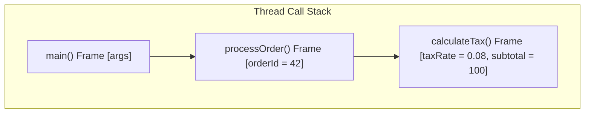

When `calculateTax()` returns, its stack frame is instantly destroyed, returning control and the return value to `processOrder()`.
- **StackOverflowError:** Occurs if a recursive method calls itself indefinitely without hitting a base case, exhausting stack memory.

### 5.2 Method Overloading

In JavaScript, you cannot define two functions with the same name (the second overwrites the first). You simulate different signatures by checking `arguments.length` or optional undefined parameters.

In Java, **Method Overloading** is a core compile-time feature. Multiple methods in the same class can share the exact same name, as long as their parameter lists differ in count or types:

```java
public class Calculator {
    // Overload 1: Two integers
    public int add(int a, int b) {
        return a + b;
    }

    // Overload 2: Three integers
    public int add(int a, int b, int c) {
        return a + b + c;
    }

    // Overload 3: Two doubles
    public double add(double a, double b) {
        return a + b;
    }
}
```

### 5.3 Varargs (Variable-Length Arguments)

Similar to JavaScript rest parameters (`...args`), Java provides **Varargs** (`Type... name`):

```java
public class MathUtils {
    // 'int... nums' is treated as 'int[] nums' inside the method body
    public static int sum(int... nums) {
        int total = 0;
        for (int n : nums) {
            total += n;
        }
        return total;
    }

    public static void main(String[] args) {
        sum(1, 2, 3);    // 6
        sum(10, 20);      // 30
        sum();            // 0 (nums is an empty array int[0])
    }
}
```

> [!IMPORTANT]
> **Varargs Rules:**
> 1. A method can have only **one** varargs parameter.
> 2. The varargs parameter **must be the last parameter** in the signature (`void log(String tag, int level, String... messages)`).


### 5.5 Early Returns in `void` Methods

In a `void` method, you do not return a value, but you can use **`return;`** to terminate method execution early as a guard clause:

```java
public void processTransaction(double amount) {
    if (amount <= 0) {
        System.err.println("Invalid amount. Aborting.");
        return; // Exits the method immediately
    }
    System.out.println("Processing payment of $" + amount);
}
```

### 5.4 Null Safety & `Optional<T>` (Java 8+)

In Java, returning `null` from a method forces the caller to write defensive `if (res != null)` guards everywhere. Forgetting to do so results in a runtime `NullPointerException` (NPE).

To make missing values explicit in method signatures, modern Java uses **`Optional<T>`**:

```java
import java.util.Optional;

public class UserRepository {
    public Optional<String> findEmailById(String userId) {
        if ("user123".equals(userId)) {
            return Optional.of("user@example.com"); // Value present
        }
        return Optional.empty(); // Explicit empty container
    }
}
```

**Consuming `Optional` Elegantly:**
```java
Optional<String> emailOpt = repo.findEmailById("user123");

// 1. Fallback default if absent:
String email = emailOpt.orElse("default@example.com");

// 2. Compute fallback lazily (only executed if absent):
String emailLazy = emailOpt.orElseGet(() -> fetchDefaultFromConfig());

// 3. Throw custom exception if absent:
String userEmail = emailOpt.orElseThrow(() -> new IllegalArgumentException("User not found"));

// 4. Functional transformation:
emailOpt.map(String::toUpperCase)
        .ifPresent(System.out::println);
```

---

### Module 5 Practice Challenges

#### Challenge 5.1 (LeetCode 704): Binary Search with Midpoint Overflow Protection
**Problem:** Given a sorted array of integers `nums` and a `target` value, write a method `search(int[] nums, int target)` that returns the index of target if found, or `-1` if not found, in $O(\log n)$ runtime.

**Thought Process & Strategy (Step-by-Step):**
1. **Precondition:** Input array is sorted in ascending order.
2. **Maintain Boundaries:** Use `left = 0` and `right = nums.length - 1`.
3. **Midpoint Overflow Protection:** In Java, writing `(left + right) / 2` causes integer overflow if `left + right > 2,147,483,647`. Writing `left + (right - left) / 2` avoids overflow.
4. **Halve Search Range:** Compare `nums[mid]` to target:
   - If equal: return `mid`.
   - If smaller: target is in right half (`left = mid + 1`).
   - If larger: target is in left half (`right = mid - 1`).
5. **Exit Condition:** If `left > right`, target is absent; return `-1`.

```java
public class BinarySearch {
    public static int search(int[] nums, int target) {
        int left = 0;
        int right = nums.length - 1;

        while (left <= right) {
            // CRITICAL: Writing (left + right) / 2 can OVERFLOW the 32-bit int limit if both are large!
            // Using left + (right - left) / 2 is mathematically identical and overflow-safe.
            int mid = left + (right - left) / 2;

            if (nums[mid] == target) {
                return mid; // Target located
            } else if (nums[mid] < target) {
                left = mid + 1; // Discard left half
            } else {
                right = mid - 1; // Discard right half
            }
        }

        return -1; // Target not present
    }

    public static void main(String[] args) {
        int[] sorted = {-1, 0, 3, 5, 9, 12};
        System.out.println("Index of 9: " + search(sorted, 9)); // 4
        System.out.println("Index of 2: " + search(sorted, 2)); // -1
    }
}
// Time Complexity: O(log n) - Search space halved at each iteration
// Space Complexity: O(1) - Constant auxiliary pointers
```

#### Challenge 5.2: Safe Configuration Lookup Pipeline
**Problem:** Implement a service that retrieves a user's role from a configuration map, strips surrounding whitespace, transforms it to uppercase, and returns a fallback `"GUEST"` if the role is missing or empty.

```java
import java.util.Map;
import java.util.Optional;

public class ConfigService {
    private final Map<String, String> userRoles = Map.of(
        "admin_user", "  administrator ",
        "editor_user", " editor "
    );

    public String resolveUserRole(String userId) {
        return Optional.ofNullable(userRoles.get(userId)) // Wraps potential null in Optional
            .map(String::trim)                            // Trim leading/trailing whitespace
            .filter(role -> !role.isEmpty())              // Discard if empty string
            .map(String::toUpperCase)                     // Convert to uppercase
            .orElse("GUEST");                             // Safe default fallback
    }

    public static void main(String[] args) {
        ConfigService svc = new ConfigService();
        System.out.println(svc.resolveUserRole("admin_user"));   // "ADMINISTRATOR"
        System.out.println(svc.resolveUserRole("unknown_user")); // "GUEST"
    }
}
// Time Complexity: O(1) map lookup
// Space Complexity: O(1)
```


---

## Module 6: Arrays & Core Data Structures

### 6.1 Fixed-Size Arrays & Memory Allocation

In JavaScript, arrays are flexible dynamic lists that can hold heterogeneous items (`[1, "two", true]`).
In Java, primitive arrays are **fixed in capacity** and **strictly homogeneous**:

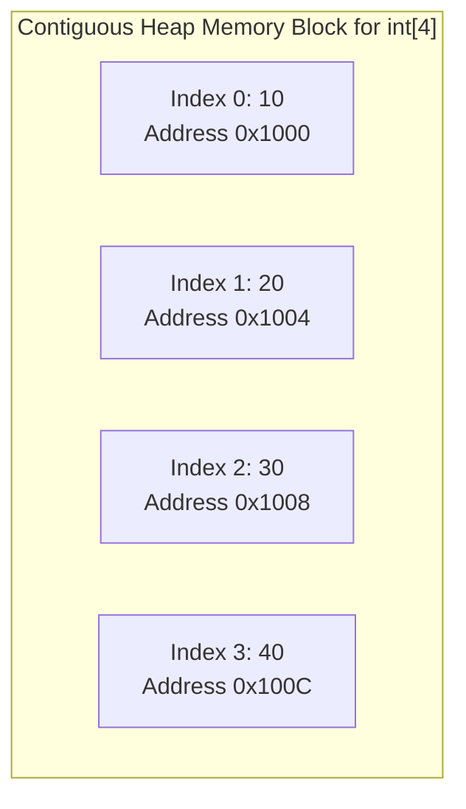

Because elements are stored in a **contiguous block of memory**, accessing any index is a constant-time $O(1)$ calculation:
$$\text{MemoryAddress}(i) = \text{BaseAddress} + (i \times \text{ElementSize})$$

```java
// Allocation: specifies size; elements initialize to type defaults (0 for int)
int[] scores = new int[4];
scores[0] = 10;
scores[1] = 20;

// Literal initialization:
String[] days = {"Mon", "Tue", "Wed", "Thu", "Fri"};
int totalDays = days.length; // Array length is a public final field, NOT a method!
```

### 6.2 2D Arrays & Matrices

Matrices are arrays of arrays. In LeetCode (grid traversal, dynamic programming), 2D arrays are fundamental:

```java
// 3 rows, 4 columns matrix
int[][] grid = new int[3][4];

int rowCount = grid.length;       // 3
int colCount = grid[0].length;    // 4

// Initializing with data:
int[][] matrix = {
    {1, 2, 3},
    {4, 5, 6},
    {7, 8, 9}
};
int cell = matrix[1][2]; // Row 1, Col 2 -> 6
```

### 6.3 Array Utilities (`java.util.Arrays`)

Directly printing an array (`System.out.println(matrix)`) prints its internal class hash (e.g. `[[I@28d93b30`). Always use the static helper methods in `java.util.Arrays`:

```java
import java.util.Arrays;

int[] arr = {5, 3, 8, 1, 2};

// 1. In-place sorting (Dual-Pivot Quicksort: O(n log n))
Arrays.sort(arr); // [1, 2, 3, 5, 8]

// 2. Readable string representation:
System.out.println(Arrays.toString(arr)); // "[1, 2, 3, 5, 8]"

// 3. Deep string representation for multidimensional arrays:
int[][] grid = {{1, 2}, {3, 4}};
System.out.println(Arrays.deepToString(grid)); // "[[1, 2], [3, 4]]"

// 4. Binary search (array MUST be sorted first!):
int index = Arrays.binarySearch(arr, 5); // 3

// 5. Fill array with a specific value:
Arrays.fill(arr, -1); // [-1, -1, -1, -1, -1]

// 6. Deep copy:
int[] copy = Arrays.copyOf(arr, arr.length);
```

### 6.4 Dynamic Arrays: `ArrayList<T>` vs. Primitive Arrays

When you need an array that grows and shrinks dynamically, use **`ArrayList<T>`**:

| Feature | Primitive Array (`int[]`) | `ArrayList<T>` |
|---|---|---|
| **Capacity** | Fixed at creation | Dynamically resizes automatically ($1.5\times$ growth) |
| **Primitives** | Stores raw primitives directly (`int`) | Requires Wrapper classes (`Integer`) |
| **Performance** | Maximum speed, zero object overhead | Slight overhead due to object wrappers |
| **Length** | `arr.length` (field) | `list.size()` (method) |
| **Element Access** | `arr[i]` | `list.get(i)` and `list.set(i, val)` |

```java
import java.util.ArrayList;
import java.util.List;

// Always code to the interface 'List':
List<String> fruits = new ArrayList<>();
fruits.add("Apple");
fruits.add("Banana");
fruits.add(0, "Mango"); // Insert at index 0 (shifts elements right: O(n))

fruits.remove(1); // Removes "Apple"
String item = fruits.get(0); // "Mango"
boolean exists = fruits.contains("Banana"); // true
```

### 6.5 Canonical LeetCode Data Structures: `ListNode` & `TreeNode`

On LeetCode, nearly every Linked List and Binary Tree question requires working with self-referential class definitions. In JavaScript, you can manipulate raw object literals `{ val: 1, next: null }`. In Java, you must understand their exact recursive class models:

#### 1. Singly-Linked List: `ListNode`
```java
public class ListNode {
    public int val;
    public ListNode next;

    public ListNode() {}
    public ListNode(int val) { this.val = val; }
    public ListNode(int val, ListNode next) { this.val = val; this.next = next; }
}
```

**The Sentinel / Dummy Head Pattern (LeetCode Essential):**
When building or modifying linked lists (e.g. LeetCode 21: Merge Two Sorted Lists), always initialize a **Dummy Head** to avoid edge-case checks for empty lists:
```java
ListNode dummy = new ListNode(0); // Placeholder start
ListNode current = dummy;
// current.next = new ListNode(value); current = current.next;
return dummy.next; // Returns the real head of the new list
```

#### 2. Binary Tree: `TreeNode`
```java
public class TreeNode {
    public int val;
    public TreeNode left;
    public TreeNode right;

    public TreeNode() {}
    public TreeNode(int val) { this.val = val; }
    public TreeNode(int val, TreeNode left, TreeNode right) {
        this.val = val;
        this.left = left;
        this.right = right;
    }
}
```

**Standard Level-Order Traversal (BFS) using a Queue:**
```java
import java.util.ArrayDeque;
import java.util.Queue;

public void levelOrder(TreeNode root) {
    if (root == null) return;

    Queue<TreeNode> queue = new ArrayDeque<>();
    queue.offer(root);

    while (!queue.isEmpty()) {
        int levelSize = queue.size();
        for (int i = 0; i < levelSize; i++) {
            TreeNode node = queue.poll();
            System.out.print(node.val + " ");

            if (node.left != null) queue.offer(node.left);
            if (node.right != null) queue.offer(node.right);
        }
        System.out.println(); // Next level
    }
}
```

---

### Module 6 Practice Challenges

#### Challenge 6.1 (LeetCode 1): Two Sum
**Problem:** Given an array of integers `nums` and an integer `target`, return indices of the two numbers such that they add up to `target`. Assume exactly one solution exists, and you cannot use the same element twice.

**Thought Process & Strategy (Step-by-Step):**
1. **Complement Formulation:** For any number $x$, we require $complement = target - x$.
2. **Hash Table Lookup:** Rather than checking all pairs in $O(n^2)$ time, store visited numbers in a `HashMap<Integer, Integer>` (mapping number $\rightarrow$ index).
3. **One-Pass Scan:** For each element at index `i`:
   - Check if `complement` is already in the map.
   - If found: return `[map.get(complement), i]` immediately.
   - If not found: record `map.put(nums[i], i)`.

```java
import java.util.HashMap;
import java.util.Map;

public class TwoSum {
    public static int[] twoSum(int[] nums, int target) {
        // Map to store: number -> index
        Map<Integer, Integer> complementMap = new HashMap<>();

        for (int i = 0; i < nums.length; i++) {
            int currentNum = nums[i];
            int complement = target - currentNum;

            // Check if complement was already seen in our forward pass
            if (complementMap.containsKey(complement)) {
                return new int[] { complementMap.get(complement), i };
            }

            // Record current number and its index
            complementMap.put(currentNum, i);
        }

        throw new IllegalArgumentException("No two sum solution found");
    }

    public static void main(String[] args) {
        int[] nums = {2, 7, 11, 15};
        int[] result = twoSum(nums, 9);
        System.out.println("Indices: [" + result[0] + ", " + result[1] + "]"); // [0, 1]
    }
}
// Time Complexity: O(n) - Single linear pass
// Space Complexity: O(n) - Stores up to n elements in HashMap
```

#### Challenge 6.2 (LeetCode 53): Maximum Subarray (Kadane's Algorithm)
**Problem:** Given an integer array `nums`, find the subarray with the largest sum, and return its sum.

**Thought Process & Strategy (Step-by-Step):**
1. **Dynamic Programming Decision:** At each element `nums[i]`, decide whether to:
   - Add `nums[i]` to the existing running subarray sum.
   - Or discard the previous negative sum and start a fresh subarray at `nums[i]`.
   - Formula: `currentSum = Math.max(nums[i], currentSum + nums[i])`.
2. **Maintain Global Max:** Update `maxSoFar = Math.max(maxSoFar, currentSum)` at each iteration.

```java
public class MaxSubarray {
    public static int maxSubArray(int[] nums) {
        int maxSoFar = nums[0];
        int currentRunningSum = nums[0];

        // Traverse starting from second element
        for (int i = 1; i < nums.length; i++) {
            // Decision: Start a fresh subarray at nums[i], or extend the existing subarray?
            currentRunningSum = Math.max(nums[i], currentRunningSum + nums[i]);

            // Update overall global maximum
            maxSoFar = Math.max(maxSoFar, currentRunningSum);
        }

        return maxSoFar;
    }

    public static void main(String[] args) {
        int[] nums = {-2, 1, -3, 4, -1, 2, 1, -5, 4};
        System.out.println("Max subarray sum: " + maxSubArray(nums)); // 6 (Subarray [4, -1, 2, 1])
    }
}
// Time Complexity: O(n) - One pass over array
// Space Complexity: O(1) - Two tracking integer variables
```


---

## Module 7: Object-Oriented Programming Foundations

### 7.1 Classes, Fields, Constructors & `this`

A **Class** is an architectural blueprint. An **Object** is a concrete instance allocated on the Heap.

```java

> [!NOTE]
> **The Default 0-Argument Constructor Rule:**
> If you write **no constructors** in your class, the Java compiler automatically inserts an invisible `public ClassName() {}` constructor.
> However, the moment you declare **any constructor with parameters**, Java **removes** that default constructor! If you still need a 0-arg constructor (e.g. for JSON serialization frameworks like Jackson), you must declare it explicitly.

public class BankAccount {
    // 1. State (Fields / Instance Variables)
    private String accountNumber;
    private double balance;

    // 2. Constructor: Executes when 'new BankAccount(...)' is called
    public BankAccount(String accountNumber, double initialDeposit) {
        // 'this' refers to the current object instance, disambiguating field from parameter
        this.accountNumber = accountNumber;
        this.balance = initialDeposit;
    }

    // 3. Overloaded Constructor (Constructor Chaining using this(...))
    public BankAccount(String accountNumber) {
        this(accountNumber, 0.0); // Calls the two-argument constructor above!
    }

    // 4. Methods (Behavior)
    public void deposit(double amount) {
        if (amount > 0) {
            this.balance += amount;
        }
    }

    public double getBalance() {
        return this.balance;
    }
}
```

### 7.2 Access Modifiers & Encapsulation

Encapsulation hides the internal state of an object and enforces invariants through method boundaries. Java provides four access levels:

| Modifier | Visibility Scope | Best Used For |
|---|---|---|
| **`private`** | Inside the class only | All instance fields, private helpers |
| *(default / package-private)* | Inside the same folder/package | Package-internal utilities |
| **`protected`** | Same package + Subclasses | Methods intended to be customized by children |
| **`public`** | Everywhere across the application | API contracts, DTOs, public services |

### 7.3 `static` Context vs. Instance Context

- **`static` members:** Belong to the **Class Blueprint** itself. Stored in Metaspace. Shared across all instances.
- **Instance members:** Belong to individual **Objects** on the Heap.

```java
public class Session {
    public static int activeSessionCount = 0; // Shared counter
    public String sessionId;                   // Unique per instance

    public Session(String id) {
        this.sessionId = id;
        activeSessionCount++; // Increments shared global counter
    }
}
```

> [!NOTE]
> **Why `static` methods cannot access `this` or instance fields:**
> Static methods run without any object instance. Since no instance exists, calling `this.sessionId` from a static method produces a compile error: *"non-static variable cannot be referenced from a static context"*.

### 7.4 Modern Data Carriers: Records (Java 16+)

In JavaScript, creating a data holder is as easy as `{ id: 1, name: "Alex" }`. In traditional Java, creating a simple Data Transfer Object (DTO) required writing:
- `private final` fields
- Constructor
- Getters for every field
- `equals()` and `hashCode()`
- `toString()`

Modern Java introduces **`record`**, eliminating this boilerplate:

```java
// One single line defines an immutable data carrier!
public record UserDto(String id, String name, String email) {}

// Usage:
UserDto user = new UserDto("101", "Alex", "alex@mail.com");
System.out.println(user.name());  // Accessor method (omits 'get' prefix)
System.out.println(user.email());
System.out.println(user);         // UserDto[id=101, name=Alex, email=alex@mail.com]
```
Records are automatically `final`, provide value-based `.equals()` and `.hashCode()`, and prevent field mutation.

### 7.5 The `equals()` and `hashCode()` Contract

Every class in Java inherits from `java.lang.Object`. By default:
- `equals()` checks if two references share the same memory address (`this == obj`).
- `hashCode()` returns an integer derived from the object's internal memory address.

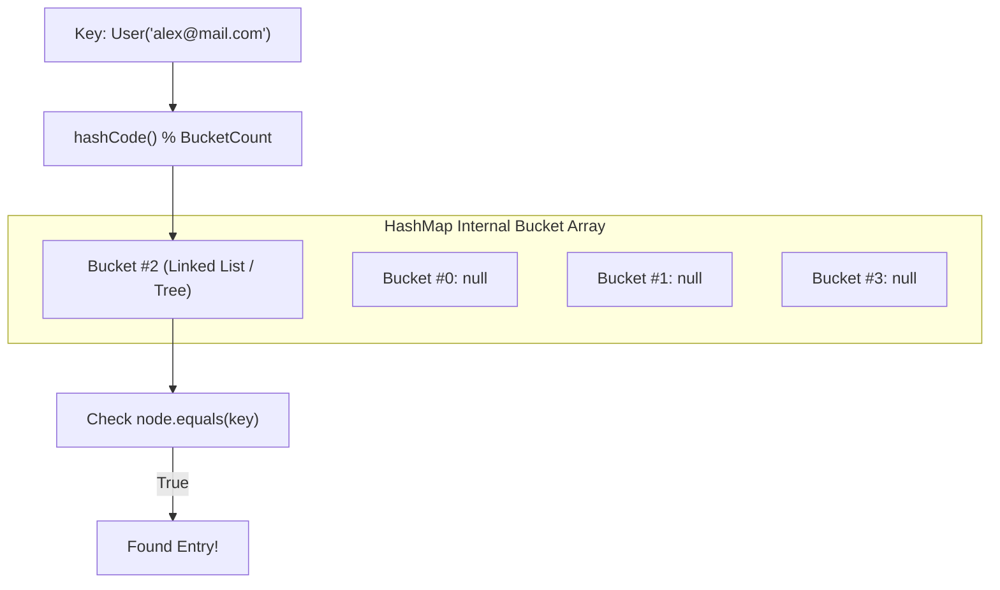

> [!WARNING]
> **⚠️ The Golden Hash Contract:**
> 1. **If `a.equals(b)` is `true`, then `a.hashCode() == b.hashCode()` MUST be true.**
> 2. If you override `equals()`, you **MUST always override `hashCode()`**.
> If you violate this contract, `HashSet` and `HashMap` will calculate different bucket indexes for two identical objects, causing `map.get(existingKey)` to return `null`!

**Idiomatic Implementation using `java.util.Objects`:**
```java
import java.util.Objects;

public class Employee {
    private String id;
    private String department;

    @Override
    public boolean equals(Object o) {
        // 1. Same memory reference check (fast path)
        if (this == o) return true;
        // 2. Null check & exact class comparison
        if (o == null || getClass() != o.getClass()) return false;
        // 3. Cast and compare significant fields
        Employee employee = (Employee) o;
        return Objects.equals(id, employee.id) &&
               Objects.equals(department, employee.department);
    }

    @Override
    public int hashCode() {
        // Generates hash from the exact same fields compared in equals()
        return Objects.hash(id, department);
    }
}
```


### 7.6 'final' Reference Immutability vs. Object State Mutability

One of the most common beginner misunderstandings in Java is assuming `final` makes an object immutable:

```java
// 'final' on a reference variable:
final List<String> shoppingList = new ArrayList<>();

// 1. MUTATION IS ALLOWED: The object on the Heap is NOT frozen!
shoppingList.add("Milk");
shoppingList.add("Eggs");
System.out.println(shoppingList); // [Milk, Eggs]

// 2. REASSIGNMENT IS FORBIDDEN: The reference pointer on the stack cannot change
// shoppingList = new ArrayList<>(); // COMPILE ERROR: cannot assign a value to final variable
```

> [!NOTE]
> **Reference vs. State:**
> - `final` locks the **pointer variable on the Stack** (it can never point to a different heap address).
> - `final` does **not** freeze the internal state of the object residing on the Heap.

### 7.7 The `toString()` Contract & Object Identity

Whenever you pass an object to `System.out.println(myObject)` or concatenate it with a String (`"User: " + myObject`), Java automatically invokes its `.toString()` method.

By default, `java.lang.Object` implements `toString()` as:
`getClass().getName() + "@" + Integer.toHexString(hashCode())`

```java
public class User {
    private String name = "Alex";
}

User u = new User();
System.out.println(u); // Prints something like: User@1b6d3586 (Unhelpful!)
```

Always override `toString()` in your domain classes for clean debugging and logging:
```java
@Override
public String toString() {
    return "User{name='" + name + "'}";
}
// Now System.out.println(u) prints: User{name='Alex'}
```

### 7.8 Java Enums: Type-Safe Classes with Behavior

In TypeScript or C#, an `enum` is merely a numeric or string lookup table. In Java, **an `enum` is a specialized, full-fledged Class**:
- It can have fields, constructors, and methods.
- It can implement interfaces.
- The JVM guarantees that only one instance of each enum constant ever exists in memory (making them ideal for singletons and state machines).

```java
public enum OrderStatus {
    // Enum constants (each invokes the private constructor below)
    PENDING(100, "Order Placed"),
    PROCESSING(200, "In Warehouse"),
    SHIPPED(300, "On the Way"),
    DELIVERED(400, "Completed");

    private final int code;
    private final String description;

    // Enum constructors are strictly private
    OrderStatus(int code, String description) {
        this.code = code;
        this.description = description;
    }

    public int getCode() { return code; }
    public String getDescription() { return description; }

    public boolean isFinished() {
        return this == DELIVERED;
    }
}

// Usage in code and modern switch:
OrderStatus status = OrderStatus.SHIPPED;
System.out.println(status.getDescription()); // "On the Way"

String nextAction = switch (status) {
    case PENDING -> "Review payment";
    case PROCESSING, SHIPPED -> "Track delivery";
    case DELIVERED -> "Send feedback survey";
};
```

### 7.9 Nested, Inner & Anonymous Classes

Java allows defining a class inside another class:

#### 1. Static Nested Class (Independent helper)
Does not need an instance of the outer class. Commonly used for DTOs or the **Builder Pattern**:
```java
public class HttpRequest {
    private String url;

    public static class Builder { // Static Nested Class
        private String url;
        public Builder url(String url) { this.url = url; return this; }
        public HttpRequest build() { return new HttpRequest(); }
    }
}
// Instantiation:
HttpRequest.Builder b = new HttpRequest.Builder();
```

#### 2. Inner Class (Non-static: tightly coupled)
Has an implicit reference to the enclosing outer instance and can directly access outer private fields (`OuterClass.this.field`).

#### 3. Anonymous Class (On-the-fly implementation)
Instantiates an interface or abstract class inline without declaring a formal subclass:
```java
// Pre-lambda style (still common for multi-method interfaces):
Runnable r = new Runnable() {
    @Override
    public void run() {
        System.out.println("Running in anonymous class");
    }
};
```

---

### Module 7 Practice Challenges

#### Challenge 7.1: Immutable Value Object Pattern
**Problem:** Build an immutable `Money` value object representing a currency and amount. Enforce that:
1. Two `Money` instances with the same currency and amount are equal via `.equals()`.
2. Amounts cannot be negative.
3. Adding two `Money` instances returns a *new* `Money` instance and throws an exception if currencies do not match.

**Thought Process & Strategy (Step-by-Step):**
1. **Enforce Immutability:** Declare class `final` and all fields `private final`.
2. **Defensive Validation in Constructor:** Reject negative amounts with `IllegalArgumentException` and ensure `currency` is not null via `Objects.requireNonNull()`.
3. **Return New Instances on Mutation:** In `add()`, calculate sum and return `new Money(this.amount + other.amount, this.currency)`.
4. **Override `equals()` and `hashCode()`:** Compare amounts using `Double.compare()` and currencies using `.equals()`.

```java
import java.util.Objects;

public final class Money {
    private final double amount;
    private final String currency;

    public Money(double amount, String currency) {
        if (amount < 0) {
            throw new IllegalArgumentException("Amount cannot be negative: " + amount);
        }
        this.amount = amount;
        this.currency = Objects.requireNonNull(currency, "Currency cannot be null");
    }

    public Money add(Money other) {
        if (!this.currency.equals(other.currency)) {
            throw new IllegalArgumentException("Cannot add distinct currencies: " + this.currency + " vs " + other.currency);
        }
        return new Money(this.amount + other.amount, this.currency);
    }

    public double getAmount() { return amount; }
    public String getCurrency() { return currency; }

    @Override
    public boolean equals(Object o) {
        if (this == o) return true;
        if (o == null || getClass() != o.getClass()) return false;
        Money money = (Money) o;
        return Double.compare(money.amount, amount) == 0 &&
               currency.equals(money.currency);
    }

    @Override
    public int hashCode() {
        return Objects.hash(amount, currency);
    }

    @Override
    public String toString() {
        return String.format("%.2f %s", amount, currency);
    }

    public static void main(String[] args) {
        Money m1 = new Money(50.0, "USD");
        Money m2 = new Money(25.0, "USD");
        Money total = m1.add(m2);

        System.out.println("Total: " + total); // 75.00 USD
        System.out.println("Equality: " + m1.equals(new Money(50.0, "USD"))); // true
    }
}
// Time Complexity: O(1) for all operations
// Space Complexity: O(1)
```


---

## Module 8: Advanced OOP, Polymorphism & Design

### 8.1 Inheritance (`extends`, `super`, `@Override`)

Inheritance allows a subclass to inherit fields and methods from a parent superclass. Java supports **single inheritance** for classes (a class can only `extend` one superclass).

```java
public class Employee {
    protected String name;
    protected double baseSalary;

    public Employee(String name, double baseSalary) {
        this.name = name;
        this.baseSalary = baseSalary;
    }

    public double calculateCompensation() {
        return this.baseSalary;
    }
}

public class Manager extends Employee {
    private double bonus;

    public Manager(String name, double baseSalary, double bonus) {
        super(name, baseSalary); // Calls parent constructor (MUST be first line)
        this.bonus = bonus;
    }

    @Override // Compiler verifies this method actually overrides a parent method
    public double calculateCompensation() {
        return super.calculateCompensation() + this.bonus;
    }
}
```

### 8.2 Polymorphism & Dynamic Method Dispatch

Polymorphism allows a superclass reference to transparently point to any subclass object at runtime:

```java
Employee emp1 = new Employee("Alice", 70000);
Employee emp2 = new Manager("Bob", 90000, 20000); // Upcasting to Employee

// The JVM resolves the method at RUNTIME based on the actual Heap object (Dynamic Dispatch):
System.out.println(emp1.calculateCompensation()); // 70000.0 (Calls Employee method)
System.out.println(emp2.calculateCompensation()); // 110000.0 (Calls Manager method!)
```

**Pattern Matching for `instanceof` (Java 16+):**
```java
// Traditional Java:
if (emp2 instanceof Manager) {
    Manager m = (Manager) emp2; // Clumsy manual casting
    System.out.println("Manager bonus: " + m.calculateCompensation());
}

// Modern Java 16+:
if (emp2 instanceof Manager m) {
    // 'm' is automatically cast and in scope here!
    System.out.println("Manager bonus: " + m.calculateCompensation());
}
```

### 8.3 Abstract Classes vs. Interfaces

- **Abstract Class (`abstract`):** An incomplete class that cannot be instantiated directly. Represents an **"IS-A"** relationship with shared state and default implementations.
- **Interface (`interface`):** A contract defining what an object **"CAN-DO"**. A class can implement **multiple** interfaces.

| Feature | Abstract Class | Interface |
|---|---|---|
| **Multiple Inheritance** | No (Single `extends` only) | **Yes** (Can `implements` multiple) |
| **State / Fields** | Can have instance variables (`private int x;`) | Only `public static final` constants |
| **Constructors** | Yes (called via `super()`) | No constructors |
| **Default Methods** | Standard instance methods | `default` keyword (Java 8+) |

```java
public interface Drivable {
    void drive(); // Implicitly public abstract
}

public interface Flyable {
    void fly();

    // Default method (provides optional shared behavior without breaking implementers):
    default void hover() {
        System.out.println("Hovering in mid-air");
    }
}

// FlyingCar implements multiple interfaces:
public class FlyingCar implements Drivable, Flyable {
    @Override
    public void drive() { System.out.println("Driving on road"); }

    @Override
    public void fly() { System.out.println("Flying in sky"); }
}
```

### 8.4 Composition over Inheritance

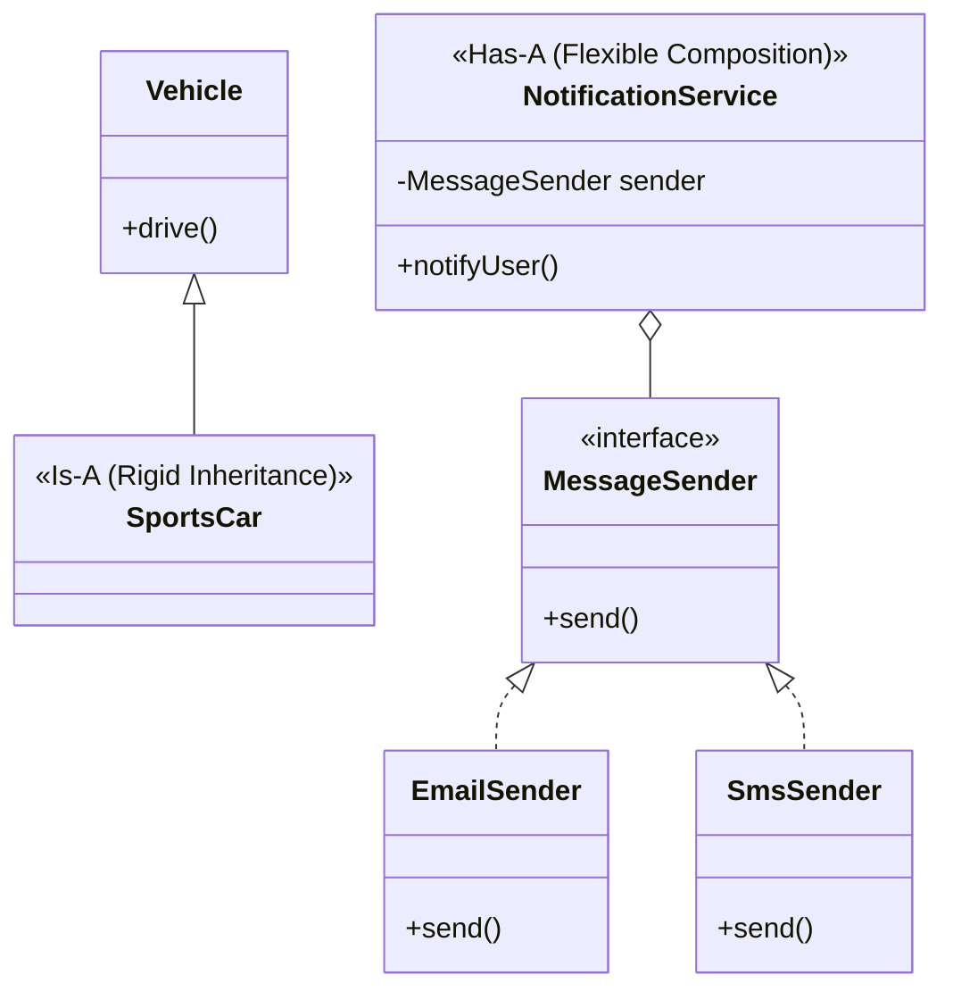

### 8.5 Annotations: Compiler & Runtime Metadata

Annotations (prefixed with `@`) attach metadata to classes, methods, or fields without altering their core logic.

```java
// Common Built-in Annotations:
@Override        // Compiler check: ensures method actually overrides superclass
@Deprecated      // Warning: informs developers that the method is obsolete
@SuppressWarnings("unchecked") // Suppresses specific compiler lint warnings
```

**How Annotations Work:**
1. **Compile-time annotations (e.g. `@Override`):** Examined by `javac` during compilation and discarded.
2. **Runtime annotations (e.g. `@Entity`, `@RestController`, `@Test`):** Retained in `.class` bytecode and inspected at runtime via **Java Reflection** by frameworks like Spring Boot, Jackson, or JUnit.

### 8.6 Sealed Classes & Interfaces (Java 17 LTS: Discriminated Unions)

In TypeScript, you represent a finite set of types with discriminated unions:
`type Shape = Circle | Rectangle;`

In Java 17+, you accomplish this with **`sealed`** classes and interfaces using the **`permits`** keyword:

```java
// Only Circle and Rectangle are permitted to implement Shape!
public sealed interface Shape permits Circle, Rectangle {}

public final class Circle implements Shape {
    private final double radius;
    public Circle(double radius) { this.radius = radius; }
    public double radius() { return radius; }
}

public final class Rectangle implements Shape {
    private final double width, height;
    public Rectangle(double width, double height) { this.width = width; this.height = height; }
    public double width() { return width; }
    public double height() { return height; }
}
```

**Compiler-Exhaustive Pattern Matching:**
Because the compiler knows all permitted subtypes of `Shape`, you can switch over it **without needing a `default` branch**:
```java
public static double calculateArea(Shape shape) {
    // Compiler verifies that Circle and Rectangle are fully handled!
    return switch (shape) {
        case Circle c    -> Math.PI * c.radius() * c.radius();
        case Rectangle r -> r.width() * r.height();
    };
}
```


> [!TIP]
> **Favor Composition Over Inheritance:**
> Inheritance creates tight coupling. If a superclass changes its implementation, subclasses can break unexpectedly ("Fragile Base Class problem").
> Composition ("Has-A") injects dependencies via interfaces, making implementations modular, swappable, and effortlessly mockable for unit testing.

---

### Module 8 Practice Challenges

#### Challenge 8.1 (Design Pattern): Strategy Pattern for Pricing Discounts
**Problem:** Build a dynamic checkout system where different discount algorithms (`NoDiscount`, `PercentageDiscount`, `FlatDiscount`) can be selected and applied at runtime using an interface.

**Thought Process & Strategy (Step-by-Step):**
1. **Strategy Interface:** Create `DiscountStrategy` with `double applyDiscount(double originalPrice)`.
2. **Implementations:** Create `PercentageDiscount` and `FlatDiscount` classes implementing the interface.
3. **Context Class (Composition):** `CheckoutService` holds a `DiscountStrategy` reference and delegates calculation.
4. **Runtime Swapping:** Provide a `setStrategy()` setter to alter pricing behavior dynamically.

```java
// 1. The Strategy Interface
interface DiscountStrategy {
    double applyDiscount(double originalPrice);
}

// 2. Concrete Strategy A: Percentage off
class PercentageDiscount implements DiscountStrategy {
    private final double percent; // e.g. 0.20 for 20%
    public PercentageDiscount(double percent) { this.percent = percent; }

    @Override
    public double applyDiscount(double originalPrice) {
        return originalPrice * (1.0 - percent);
    }
}

// 3. Concrete Strategy B: Flat dollar off
class FlatDiscount implements DiscountStrategy {
    private final double amount;
    public FlatDiscount(double amount) { this.amount = amount; }

    @Override
    public double applyDiscount(double originalPrice) {
        return Math.max(0.0, originalPrice - amount);
    }
}

// 4. Context class utilizing composition
class CheckoutService {
    private DiscountStrategy strategy;

    public CheckoutService(DiscountStrategy strategy) {
        this.strategy = strategy;
    }

    // Allows changing strategy dynamically at runtime
    public void setStrategy(DiscountStrategy strategy) {
        this.strategy = strategy;
    }

    public double calculateTotal(double subtotal) {
        return strategy.applyDiscount(subtotal);
    }

    public static void main(String[] args) {
        CheckoutService checkout = new CheckoutService(new PercentageDiscount(0.15)); // 15% off
        System.out.println("Total (15% off $100): " + checkout.calculateTotal(100.0)); // 85.0

        checkout.setStrategy(new FlatDiscount(25.0)); // Switch to $25 off
        System.out.println("Total ($25 off $100): " + checkout.calculateTotal(100.0));  // 75.0
    }
}
// Time Complexity: O(1)
// Space Complexity: O(1)
```


---

## Module 9: Generics (Type-Safe Reusability)

### 9.1 Why Generics?

Before Generics (pre-Java 5), collections stored raw `Object` references. You had to manually cast objects, leading to frequent runtime crashes:

```java
// Pre-Generics (DANGEROUS):
List oldList = new ArrayList();
oldList.add("Hello");
Integer num = (Integer) oldList.get(0); // Crashes at RUNTIME: ClassCastException!

// With Generics (TYPE-SAFE):
List<String> modernList = new ArrayList<>();
modernList.add("Hello");
// modernList.add(100); // FAILS AT COMPILE TIME!
```

### 9.2 Generic Classes & Generic Methods

You can parameterize classes and methods with placeholder types `<T>`, `<E>` (Element), `<K, V>` (Key, Value):

```java
// Generic Box container

> [!NOTE]
> **Standard Generic Type Parameter Conventions:**
> - `T`: General Type
> - `E`: Element (used in Collections like `List<E>`)
> - `K`, `V`: Key and Value (used in Maps)
> - `N`: Number
> - `R`: Return type (used in functions)

public class Box<T> {
    private T item;

    public void set(T item) { this.item = item; }
    public T get() { return this.item; }
}

// Generic Method: Operates on any type
public class ArrayPrinter {
    public static <E> void printArray(E[] array) {
        for (E element : array) {
            System.out.print(element + " ");
        }
        System.out.println();
    }
}
```

### 9.3 Bounded Generics & The PECS Rule

- **Upper Bound (`<T extends Number>`):** Restricts `T` to a specific class or interface hierarchy.
- **Wildcard (`?`):** Represents an unknown type.
  - `? extends T` (Upper bounded wildcard - Producer): You can safely **read** elements as `T`, but cannot write into it.
  - `? super T` (Lower bounded wildcard - Consumer): You can safely **write** `T` into it.

> [!NOTE]
> **PECS Mnemonic:** **P**roducer **E**xtends, **C**onsumer **S**uper.
> - If you only read data out of a collection, use `? extends T`.
> - If you only insert data into a collection, use `? super T`.

### 9.4 Type Erasure

To maintain backward compatibility with older JVM bytecode, Java uses **Type Erasure**. At compile-time, the compiler verifies all type safety checks and then **erases** generic types to their raw bounds (`Object` or the upper bound).
- At runtime on the JVM, `List<String>` and `List<Integer>` are both simply raw `List` objects.
- This is why you cannot write `new T()` or `new T[10]` directly.

---

### Module 9 Practice Challenges

#### Challenge 9.1: Type-Safe Generic `Pair<K, V>`
**Problem:** Build an immutable, generic `Pair<K, V>` data structure with accessor methods and a static factory method `Pair.of(k, v)`.

**Thought Process & Strategy (Step-by-Step):**
1. **Class Declaration:** Define `public final class Pair<K, V>` with two generic type parameters.
2. **Immutable Fields:** Make fields `private final K first;` and `private final V second;`.
3. **Static Factory Method:** Provide `<K, V> Pair<K, V> of(K first, V second)` for concise instantiation without `new`.
4. **Value Equality:** Implement `equals()` and `hashCode()` using `Objects.equals()` and `Objects.hash()`.

```java
import java.util.Objects;

public final class Pair<K, V> {
    private final K first;
    private final V second;

    public Pair(K first, V second) {
        this.first = first;
        this.second = second;
    }

    public static <K, V> Pair<K, V> of(K first, V second) {
        return new Pair<>(first, second);
    }

    public K getFirst() { return first; }
    public V getSecond() { return second; }

    @Override
    public boolean equals(Object o) {
        if (this == o) return true;
        if (o == null || getClass() != o.getClass()) return false;
        Pair<?, ?> pair = (Pair<?, ?>) o;
        return Objects.equals(first, pair.first) &&
               Objects.equals(second, pair.second);
    }

    @Override
    public int hashCode() {
        return Objects.hash(first, second);
    }

    @Override
    public String toString() {
        return "(" + first + ", " + second + ")";
    }

    public static void main(String[] args) {
        Pair<String, Integer> student = Pair.of("Alice", 98);
        System.out.println("Student: " + student); // (Alice, 98)
    }
}
// Time Complexity: O(1)
// Space Complexity: O(1)
```


---

## Module 10: The Java Collections Framework (JCF)

### 10.1 The Collections Architecture

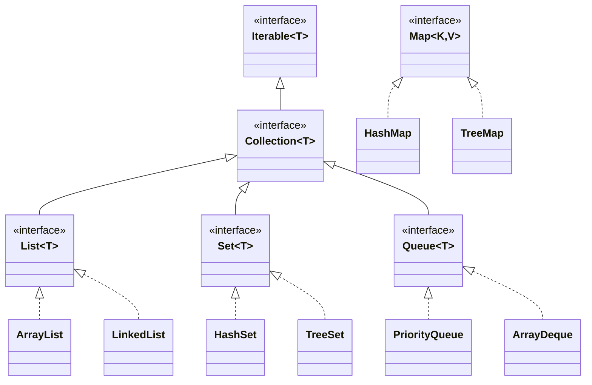

### 10.2 Big-O Complexity Comparison Table

| Collection | Underlying Data Structure | Access | Search | Insert | Delete | Ordering |
|---|---|---|---|---|---|---|
| **`ArrayList`** | Dynamically resizing array | **$O(1)$** | $O(n)$ | $O(1)$ amortized | $O(n)$ | Insertion order |
| **`LinkedList`** | Doubly-linked list | $O(n)$ | $O(n)$ | **$O(1)$** at head/tail | **$O(1)$** at node | Insertion order |
| **`HashSet`** | Hash Table (Buckets) | N/A | **$O(1)$** | **$O(1)$** | **$O(1)$** | Unordered |
| **`TreeSet`** | Red-Black Self-Balancing Tree | N/A | $O(\log n)$ | $O(\log n)$ | $O(\log n)$ | Sorted natural/comparator |
| **`HashMap`** | Hash Table + Linked Lists/Trees | **$O(1)$** key | $O(1)$ key | **$O(1)$** | **$O(1)$** | Unordered |
| **`TreeMap`** | Red-Black Tree | $O(\log n)$ key | $O(\log n)$ | $O(\log n)$ | $O(\log n)$ | Sorted by key |
| **`PriorityQueue`**| Binary Min-Heap (Array-backed) | $O(1)$ peek | $O(n)$ | **$O(\log n)$** offer | **$O(\log n)$** poll | Priority order |
| **`ArrayDeque`** | Circular array buffer | $O(1)$ ends | $O(n)$ | **$O(1)$** ends | **$O(1)$** ends | Insertion order |

### 10.3 Stacks & Queues: Use `ArrayDeque` (Not `java.util.Stack`!)

> [!WARNING]
> **⚠️ LeetCode Pro-Tip:**
> Never use `java.util.Stack`. It is a legacy class from Java 1.0 that extends `Vector` and synchronizes all methods, incurring severe performance overhead.
> **Always use `ArrayDeque` as your Stack and Queue:**
> ```java
> Deque<Integer> stack = new ArrayDeque<>();
> stack.push(10);        // Push to top
> int top = stack.pop(); // Pop from top
> int peek = stack.peek();
>
> Queue<Integer> queue = new ArrayDeque<>();
> queue.offer(10);       // Enqueue to tail
> int head = queue.poll(); // Dequeue from head
> ```

### 10.4 Heaps (`PriorityQueue`) in Java

By default, Java's `PriorityQueue` is a **Min-Heap** (smallest element at the head).

```java
import java.util.PriorityQueue;
import java.util.Collections;

// 1. Min-Heap (Default)
PriorityQueue<Integer> minHeap = new PriorityQueue<>();
minHeap.offer(10);
minHeap.offer(5);
minHeap.offer(20);
System.out.println(minHeap.poll()); // 5 (smallest removed first)

// 2. Max-Heap (Reversed)
PriorityQueue<Integer> maxHeap = new PriorityQueue<>(Collections.reverseOrder());
maxHeap.offer(10);
maxHeap.offer(5);
maxHeap.offer(20);
System.out.println(maxHeap.poll()); // 20 (largest removed first)
```


### 10.5 Collection Pitfalls & How to Iterate Maps

#### 1. How to Iterate Over a `Map`
The most efficient and idiomatic pattern to loop over key-value pairs is **`map.entrySet()`**:

```java
Map<String, Integer> stock = Map.of("Apples", 50, "Oranges", 30);

for (Map.Entry<String, Integer> entry : stock.entrySet()) {
    System.out.println(entry.getKey() + " -> " + entry.getValue());
}
```

#### 2. The `ConcurrentModificationException` Trap
> [!WARNING]
> **Never modify a Collection while iterating over it with a for-each loop!**
> ```java
> List<String> list = new ArrayList<>(List.of("A", "B", "C"));
> for (String s : list) {
>     if (s.equals("B")) list.remove(s); // CRASHES: ConcurrentModificationException!
> }
> ```
> **The Fix:** Use modern `removeIf()`:
> ```java
> list.removeIf(s -> s.equals("B")); // Safe and clean
> ```

#### 3. Queue & Heap Method Differences
| Operation | Throws Exception if Empty/Full | Returns Special Value (`false` / `null`) |
|---|---|---|
| **Insert** | `add(e)` | `offer(e)` (Best practice) |
| **Remove** | `remove()` | `poll()` (Best practice) |
| **Examine**| `element()` | `peek()` (Best practice) |

### 10.6 Sorting with `Comparable` vs `Comparator`

- **`Comparable<T>`:** Implemented on the class itself (`compareTo(T o)`). Defines natural default order.
- **`Comparator<T>`:** Passed as a lambda or helper factory (`(a, b) -> ...`). Defines custom or multi-level sorting.

```java
// 2D Array Sorting (LeetCode Interval pattern):
int[][] intervals = {{1, 3}, {8, 10}, {2, 6}};

// Sort intervals by start time ascending:
Arrays.sort(intervals, (a, b) -> Integer.compare(a[0], b[0]));

// Sort by start time ascending; break ties by end time descending:
Arrays.sort(intervals, (a, b) -> {
    if (a[0] != b[0]) return Integer.compare(a[0], b[0]);
    return Integer.compare(b[1], a[1]);
});
```

---

### Module 10 Practice Challenges

#### Challenge 10.1 (LeetCode 20): Valid Parentheses
**Problem:** Given a string `s` containing just the characters `'('`, `')'`, `'{'`, `'}'`, `'['` and `']'`, determine if the input string is valid.

**Thought Process & Strategy (Step-by-Step):**
1. **Choose Data Structure:** Matching nested brackets follows Last-In, First-Out (LIFO), making a **Stack** (`ArrayDeque`) the optimal choice.
2. **Push Expected Matches:** When an opening bracket is seen, push its corresponding *closing bracket* onto the stack (`'('` $\rightarrow$ `')'`, etc.).
3. **Match on Closing Brackets:** When a closing bracket appears, pop the top of the stack. If the stack is empty or the popped character does not match, return `false`.
4. **Final Check:** If the stack is empty after processing the entire string, all brackets were properly matched.

```java
import java.util.ArrayDeque;
import java.util.Deque;

public class ValidParentheses {
    public static boolean isValid(String s) {
        // Use ArrayDeque as a fast, unsynchronized stack
        Deque<Character> stack = new ArrayDeque<>();

        for (char c : s.toCharArray()) {
            // Push expected closing bracket onto stack when open bracket is seen
            if (c == '(') stack.push(')');
            else if (c == '{') stack.push('}');
            else if (c == '[') stack.push(']');
            else {
                // If closing bracket matches nothing or stack is empty, invalid!
                if (stack.isEmpty() || stack.pop() != c) {
                    return false;
                }
            }
        }

        return stack.isEmpty(); // Valid if all opened brackets were closed
    }

    public static void main(String[] args) {
        System.out.println(isValid("()[]{}")); // true
        System.out.println(isValid("(]"));     // false
    }
}
// Time Complexity: O(n) - Single scan over string
// Space Complexity: O(n) - Stack stores up to n/2 brackets
```

#### Challenge 10.2 (LeetCode 347): Top K Frequent Elements
**Problem:** Given an integer array `nums` and an integer `k`, return the `k` most frequent elements using a Min-Heap.

**Thought Process & Strategy (Step-by-Step):**
1. **Frequency Counting:** Count frequencies in a `HashMap<Integer, Integer>` via `countMap.put(num, countMap.getOrDefault(num, 0) + 1)`.
2. **Min-Heap of Size k:** Use a Min-Heap sorted by frequency (`Comparator.comparingInt(countMap::get)`). Keeping only $k$ elements in the heap reduces time complexity to $O(n \log k)$ (faster than sorting all $n$ elements in $O(n \log n)$).
3. **Evict Infrequent Elements:** For every unique number, add it to the heap. If heap size exceeds $k$, `poll()` evicts the least frequent element.
4. **Extract Results:** The $k$ remaining elements in the heap are the top $k$ frequent elements.

```java
import java.util.*;

public class TopKFrequent {
    public static int[] topKFrequent(int[] nums, int k) {
        // Step 1: Count element frequencies
        Map<Integer, Integer> countMap = new HashMap<>();
        for (int num : nums) {
            countMap.put(num, countMap.getOrDefault(num, 0) + 1);
        }

        // Step 2: Min-Heap storing elements based on frequency count
        PriorityQueue<Integer> minHeap = new PriorityQueue<>(
            Comparator.comparingInt(countMap::get)
        );

        // Step 3: Maintain heap of size k
        for (int num : countMap.keySet()) {
            minHeap.offer(num);
            if (minHeap.size() > k) {
                minHeap.poll(); // Evicts least frequent element
            }
        }

        // Step 4: Extract k elements from heap
        int[] result = new int[k];
        for (int i = 0; i < k; i++) {
            result[i] = minHeap.poll();
        }

        return result;
    }

    public static void main(String[] args) {
        int[] nums = {1, 1, 1, 2, 2, 3};
        System.out.println(Arrays.toString(topKFrequent(nums, 2))); // [2, 1]
    }
}
// Time Complexity: O(n log k) - Maintaining a heap of size k
// Space Complexity: O(n) - Frequency map storage
```


---

## Module 11: Exception Handling & Robust Code

### 11.1 The Exception Hierarchy

In Java, all errors and exceptions inherit from `java.lang.Throwable`:

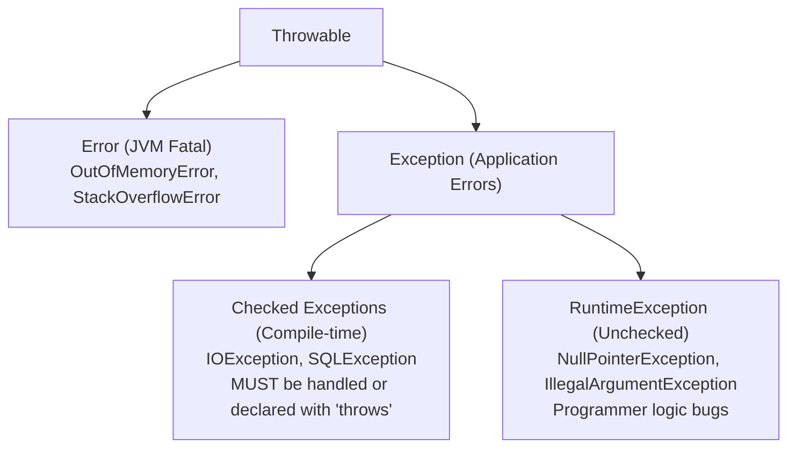

- **`Error`:** Fatal conditions from which a program cannot recover (e.g., `OutOfMemoryError`). Never catch `Error`.
- **`RuntimeException` (Unchecked):** Bugs resulting from programmer error (e.g. `NullPointerException`, `IndexOutOfBoundsException`). Handling is optional.
- **Checked `Exception`:** Anticipated environmental errors (e.g., `IOException`, `FileNotFoundException`). The compiler **forces** you to wrap them in `try-catch` or declare `throws` on the method signature.

### 11.2 `try`, `catch`, `finally` & Multi-Catch

```java
try {
    String input = "abc";
    int num = Integer.parseInt(input); // Throws NumberFormatException
} catch (NumberFormatException e) {
    System.err.println("Failed to parse number: " + e.getMessage());
} catch (NullPointerException | ArrayIndexOutOfBoundsException e) {
    // Multi-catch: Pipe '|' operator handles multiple unrelated exceptions
    System.err.println("Reference or index flaw: " + e.getMessage());
} finally {
    // ALWAYS executes, even if a return statement or exception occurred
    System.out.println("Execution block completed");
}
```

### 11.3 Try-with-Resources & `AutoCloseable`

Opening files, sockets, or database connections requires closing them to avoid memory and file handle leaks.
Any class that implements **`java.lang.AutoCloseable`** placed inside parentheses `try (...)` is **guaranteed to be closed automatically**:

```java
import java.io.BufferedReader;
import java.io.FileReader;
import java.io.IOException;

// 'reader' will be closed automatically when exiting the block!
try (BufferedReader reader = new BufferedReader(new FileReader("config.txt"))) {
    String line = reader.readLine();
    System.out.println(line);
} catch (IOException e) {
    System.err.println("File read failed: " + e.getMessage());
}
```

---

### Module 11 Practice Challenges

#### Challenge 11.1: Custom Business Exception Hierarchy
**Problem:** Build a banking transfer method `transfer(Account from, Account to, double amount)` that validates funds. If insufficient funds exist, throw a custom checked exception `InsufficientFundsException` containing the missing balance.

**Thought Process & Strategy (Step-by-Step):**
1. **Checked Exception Design:** Extend `Exception` (not `RuntimeException`) so the compiler enforces that callers must anticipate and handle insufficient funds.
2. **Attach Error Metadata:** Store `shortfall = amount - balance` inside the exception to provide context to the caller.
3. **Validate Before Mutating:** Check balance first. If inadequate, throw immediately before altering account balances.
4. **Handle with Try-Catch:** Wrap the withdrawal call in a `try-catch` block inspecting `e.getShortfall()`.

```java
// Custom Checked Exception (extends Exception)
class InsufficientFundsException extends Exception {
    private final double shortfall;

    public InsufficientFundsException(String message, double shortfall) {
        super(message);
        this.shortfall = shortfall;
    }

    public double getShortfall() { return shortfall; }
}

class BankAccount {
    private double balance;

    public BankAccount(double balance) { this.balance = balance; }

    public void withdraw(double amount) throws InsufficientFundsException {
        if (amount > balance) {
            double diff = amount - balance;
            throw new InsufficientFundsException("Insufficient account balance", diff);
        }
        balance -= amount;
    }

    public double getBalance() { return balance; }
}

public class BankTransferDemo {
    public static void main(String[] args) {
        BankAccount account = new BankAccount(100.0);

        try {
            System.out.println("Attempting to withdraw $150...");
            account.withdraw(150.0);
        } catch (InsufficientFundsException e) {
            System.err.println("Transaction Failed: " + e.getMessage());
            System.err.println("Shortfall: $" + e.getShortfall());
        }
    }
}
// Time Complexity: O(1)
// Space Complexity: O(1)
```


---

## Module 12: Functional Java: Lambdas & Streams

### 12.1 Lambdas & Single Abstract Method (SAM) Interfaces

In JavaScript, functions are first-class values. In Java, a lambda is an instance of a **Functional Interface** (an interface with exactly one abstract method):

```java
// Lambda syntax: (parameters) -> expression
Runnable task = () -> System.out.println("Async work");
```

### 12.2 Standard Functional Interfaces (`java.util.function`)

| Interface | Method Signature | Purpose | JavaScript Equivalent |
|---|---|---|---|
| **`Predicate<T>`** | `boolean test(T t)` | Filtering / Evaluation | `(x) => boolean` |
| **`Function<T, R>`**| `R apply(T t)` | Transforming / Mapping | `(x) => y` |
| **`Consumer<T>`** | `void accept(T t)` | Side effects (Printing, logging) | `(x) => void` |
| **`Supplier<T>`** | `T get()` | Factory / Lazy supplier | `() => x` |
| **`BiFunction<T, U, R>`**| `R apply(T t, U u)`| Combining two arguments | `(a, b) => c` |

### 12.3 Method References (`::`)

Concise syntax when a lambda simply passes its arguments straight to an existing method:
```java
// Static method: (s) -> Integer.parseInt(s)
Function<String, Integer> parser = Integer::parseInt;

// Instance method of arbitrary object: (s) -> s.toUpperCase()
Function<String, String> upper = String::toUpperCase;

// Instance method of specific instance: (s) -> System.out.println(s)
Consumer<String> printer = System.out::println;

// Constructor: () -> new ArrayList<>()
Supplier<List<String>> listMaker = ArrayList::new;
```

### 12.4 The Stream API Pipeline

A **Stream** is a sequence of elements supporting lazy functional transformations without mutating the backing collection:

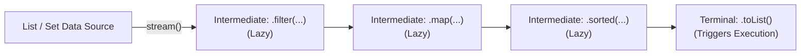

> [!NOTE]
> **Streams are Lazy:** Intermediate operations (`filter`, `map`, `distinct`, `sorted`) execute zero work until an eager **Terminal Operation** (`toList()`, `collect()`, `reduce()`, `count()`, `forEach()`) is invoked!

```java
List<String> names = List.of("alex", "bob", "alice", "charlie");

List<String> result = names.stream()
    .filter(n -> n.startsWith("a"))
    .map(String::toUpperCase)
    .sorted()
    .toList(); // Java 16+ shortcut for Collectors.toList()

System.out.println(result); // [ALEX, ALICE]
```

---

### Module 12 Practice Challenges

#### Challenge 12.1: Transaction Aggregation by Category
**Problem:** Given a list of `Transaction(String category, double amount)` records, compute the total spending for each category using Java Streams.

**Thought Process & Strategy (Step-by-Step):**
1. **Data Modeling:** Represent records with `record Transaction(String category, double amount) {}`.
2. **Stream Collector Selection:** To group entries by a field and aggregate values, use `Collectors.groupingBy()`.
3. **Downstream Summing:** Provide `Transaction::category` as the classifier function and `Collectors.summingDouble(Transaction::amount)` as the downstream reduction collector.
4. **Output:** The terminal `collect()` operation returns `Map<String, Double>`.

```java
import java.util.*;
import java.util.stream.Collectors;

record Transaction(String category, double amount) {}

public class TransactionAggregator {
    public static Map<String, Double> totalPerCategory(List<Transaction> transactions) {
        return transactions.stream()
            .collect(Collectors.groupingBy(
                Transaction::category, // Group key
                Collectors.summingDouble(Transaction::amount) // Downstream collector
            ));
    }

    public static void main(String[] args) {
        List<Transaction> list = List.of(
            new Transaction("Food", 25.50),
            new Transaction("Electronics", 120.00),
            new Transaction("Food", 14.50),
            new Transaction("Transport", 30.00)
        );

        Map<String, Double> totals = totalPerCategory(list);
        System.out.println(totals); // {Transport=30.0, Food=40.0, Electronics=120.0}
    }
}
// Time Complexity: O(n) - Single pass stream grouping
// Space Complexity: O(k) - Map of unique categories
```


---

## Module 13: Packages, Date/Time & Modern File I/O

### 13.1 Packages & Imports

Packages group related classes into namespaces and map directly to physical folder hierarchies:
```java
// File: src/main/java/com/mycompany/app/service/OrderService.java
package com.mycompany.app.service; // Must be the first non-comment line

import java.util.List;               // Explicit import
import java.util.*;                  // Wildcard import
import static java.lang.Math.PI;     // Static import
```

### 13.2 Modern Date & Time (`java.time`)

Java 8 replaced legacy `java.util.Date` with immutable, thread-safe classes:
- **`LocalDate`:** Date only (`2026-09-17`).
- **`LocalTime`:** Time only (`14:30:00`).
- **`LocalDateTime`:** Date and Time combined (`2026-09-17T14:30:00`).
- **`Instant`:** UTC timestamp since Unix Epoch.
- **`ZonedDateTime`:** Timezone-aware date and time.

```java
import java.time.*;
import java.time.format.DateTimeFormatter;

LocalDateTime now = LocalDateTime.now();
DateTimeFormatter formatter = DateTimeFormatter.ofPattern("yyyy-MM-dd HH:mm:ss");
String formatted = now.format(formatter);
```

### 13.3 Modern File I/O (`java.nio.file.Files`)

In Node.js, you use `fs.promises`. In Java 11+, **NIO.2 (`Path` and `Files`)** provides high-level static methods:

```java
import java.nio.file.Files;
import java.nio.file.Path;
import java.nio.file.StandardOpenOption;
import java.io.IOException;
import java.util.stream.Stream;

Path path = Path.of("app.log");

// 1. Write text to file
Files.writeString(path, "INFO: System started\n");

// 2. Append text to file
Files.writeString(path, "WARN: High memory\n", StandardOpenOption.APPEND);

// 3. Read entire file into a String
String content = Files.readString(path);

// 4. Memory-safe line streaming for massive multi-gigabyte log files:
try (Stream<String> lines = Files.lines(path)) {
    long errorCount = lines.filter(l -> l.contains("ERROR")).count();
    System.out.println("Error count: " + errorCount);
}
```

---

### Module 13 Practice Challenges

#### Challenge 13.1: Log File Error Frequency Counter
**Problem:** Write a method that reads a file path, filters for lines starting with `"ERROR:"`, extracts the error message, and writes the distinct error messages to an output file.

**Thought Process & Strategy (Step-by-Step):**
1. **Memory-Safe Streaming:** Large server logs can exceed RAM. Use `Files.lines(path)` to lazily stream lines one-by-one with $O(1)$ memory.
2. **Transformations:** Filter lines with `.filter(line -> line.startsWith("ERROR:"))` and extract the message via `.map(line -> line.substring(6).trim())`.
3. **Deduplicate:** Apply `.distinct()` to keep only unique messages.
4. **Resource Management:** Wrap in Try-with-Resources to ensure the underlying OS file handle is closed upon completion.
5. **Persist Output:** Write the resulting list to disk using `Files.write(outputReport, list)`.

```java
import java.nio.file.*;
import java.io.IOException;
import java.util.List;
import java.util.stream.Stream;

public class LogProcessor {
    public static void extractErrors(Path inputLog, Path outputReport) throws IOException {
        try (Stream<String> lines = Files.lines(inputLog)) {
            List<String> errorMessages = lines
                .filter(line -> line.startsWith("ERROR:"))
                .map(line -> line.substring(6).trim())
                .distinct()
                .toList();

            Files.write(outputReport, errorMessages);
        }
    }
}
// Time Complexity: O(n) line-by-line streaming
// Space Complexity: O(m) where m is number of unique errors
```


---

## Module 14: Java Ecosystem, Build Tools & Frameworks

### 14.1 Build Systems: Maven & Gradle

Java applications manage third-party dependencies and build lifecycles using Maven or Gradle (analogous to `npm` and `package.json` in JavaScript).

#### Maven (`pom.xml`):
```xml
<dependencies>
    <!-- GAV Coordinates: GroupId, ArtifactId, Version -->
    <dependency>
        <groupId>com.google.code.gson</groupId>
        <artifactId>gson</artifactId>
        <version>2.10.1</version>
    </dependency>
</dependencies>
```

#### Gradle (`build.gradle`):
```groovy
dependencies {
    implementation 'com.google.code.gson:gson:2.10.1'
}
```


### 14.2 What is a JAR File Physically?

A **JAR (Java ARchive)** file is physically a standard **ZIP compression file** containing:
1. Compiled `.class` bytecode files arranged in folders matching their package names.
2. Static resources (JSON configs, application properties, HTML/CSS assets).
3. A `META-INF/MANIFEST.MF` file that tells the JVM which class contains the `public static void main` entry point:
   ```text
   Manifest-Version: 1.0
   Main-Class: com.mycompany.app.Main
   ```
When you execute `java -jar myapp.jar`, the JVM unzips the manifest, locates the `Main-Class`, and starts execution.

### 14.3 Database Persistence: JDBC, JPA & Hibernate

- **JDBC:** Low-level standard for connecting to SQL databases and executing queries.
- **JPA (Jakarta Persistence API):** Specification defining Object-Relational Mapping (ORM).
- **Hibernate:** The dominant implementation of JPA, automatically synchronizing Java entities with SQL tables:

```java
import jakarta.persistence.*;

@Entity
@Table(name = "customers")
public class Customer {
    @Id
    @GeneratedValue(strategy = GenerationType.IDENTITY)
    private Long id;

    @Column(nullable = false, unique = true)
    private String email;
}
```

### 14.4 Enterprise Frameworks: Spring Boot

**Spring Boot** is the industry standard for Java web microservices and enterprise applications. It relies on **Inversion of Control (IoC)** and **Dependency Injection (DI)** via annotations:

```java
import org.springframework.web.bind.annotation.*;
import org.springframework.beans.factory.annotation.Autowired;

@RestController
@RequestMapping("/api/tasks")
public class TaskController {

    @Autowired // Framework automatically injects the TaskService bean
    private TaskService taskService;

    @GetMapping("/{id}")
    public TaskDto getTask(@PathVariable Long id) {
        return taskService.findTaskById(id); // Automatically serialized to JSON
    }
}
```

---

### Module 14 Practice Challenges

#### Challenge 14.1: Spring Boot REST API Architecture Design
**Problem:** Construct the complete skeleton (Record DTO, Service, and Controller) for a Spring Boot REST API that handles creating and retrieving `Product` records.

**Thought Process & Strategy (Step-by-Step):**
1. **Three-Layer Architecture Separation:**
   - **DTO / Record Layer:** Immutable data representation for network payload serialization.
   - **Service Layer:** Business rules, entity state manipulation, and database access.
   - **Controller Layer:** HTTP request mapping and response dispatching.
2. **DTO:** Declare `record ProductDto(Long id, String name, double price) {}`.
3. **Service:** Maintain state with an in-memory `Map<Long, ProductDto>` and atomic ID counter.
4. **Controller:** Route requests to service methods using Spring Web annotations.

```java
// 1. The DTO Record
record ProductDto(Long id, String name, double price) {}

// 2. The Service Layer (Business Logic)
class ProductService {
    private final Map<Long, ProductDto> database = new HashMap<>();
    private long idSequence = 1;

    public ProductDto createProduct(String name, double price) {
        Long id = idSequence++;
        ProductDto product = new ProductDto(id, name, price);
        database.put(id, product);
        return product;
    }

    public ProductDto getById(Long id) {
        return database.get(id);
    }
}

// 3. The REST Controller
// (In Spring Boot, annotated with @RestController and @RequestMapping("/api/products"))
class ProductController {
    private final ProductService productService = new ProductService();

    // Handles POST /api/products
    public ProductDto create(String name, double price) {
        return productService.createProduct(name, price);
    }

    // Handles GET /api/products/{id}
    public ProductDto getOne(Long id) {
        ProductDto p = productService.getById(id);
        if (p == null) {
            throw new NoSuchElementException("Product not found with id: " + id);
        }
        return p;
    }
}
```
